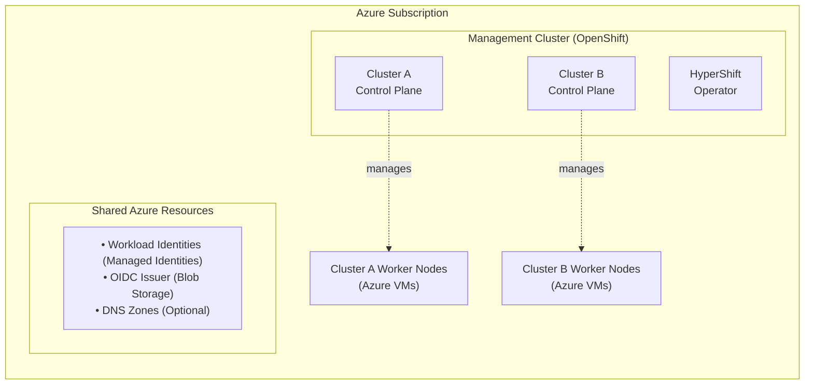
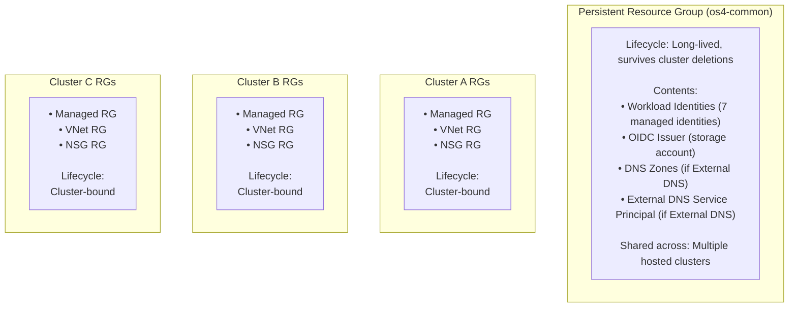
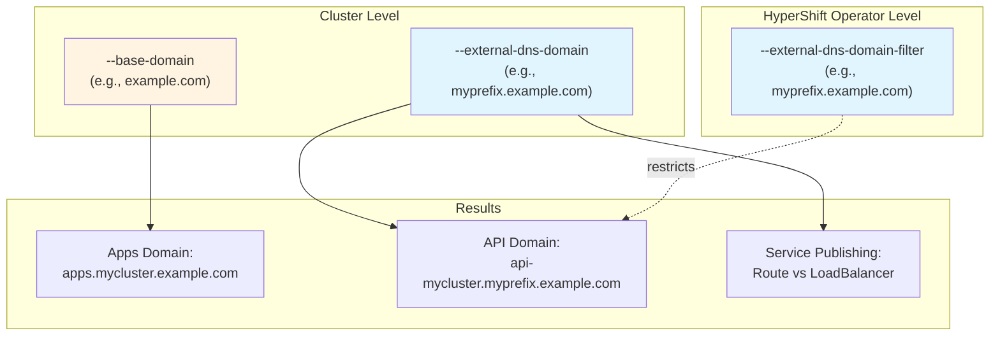

!!! warning "DEPRECATED - Documentation Restructured"

    This documentation has been reorganized into a modular structure for better navigation and clarity.

    **Please use the new documentation:**

    - [Understanding HyperShift on Azure](self-managed/01-understanding.md)
    - [Azure Planning](self-managed/02a-azure-planning.md)
    - [Workflow & Setup](self-managed/02b-workflow-planning.md)
    - [Azure Foundation Setup](self-managed/03-azure-foundation.md)
    - [Management Cluster Setup](self-managed/04-management-cluster.md)
    - [Create Hosted Clusters](self-managed/05-hosted-cluster.md)
    - [Day 2 Operations](self-managed/06-day2-operations.md)
    - [Troubleshooting](self-managed/07-troubleshooting.md)
    - [Reference](self-managed/08-reference.md)

    This file is kept for reference during content migration and will be removed.

# Getting Started with Self-Managed Azure HyperShift (DEPRECATED)

!!! note "Developer Preview in OCP 4.21"

    Self-managed Azure HostedClusters are available as a Developer Preview feature in OpenShift Container Platform 4.21.

## Introduction

### What is Self-Managed Azure HyperShift?

Self-managed Azure HyperShift enables you to deploy and manage OpenShift hosted control planes on an OpenShift management cluster running in Azure. This architecture allows you to:

- **Reduce costs**: Run multiple OpenShift control planes as pods on a shared management cluster
- **Improve density**: Host dozens of control planes on the same infrastructure
- **Simplify management**: Centralize control plane operations while isolating workload data planes
- **Increase flexibility**: Choose your own management cluster platform and customize networking

### Who is This Guide For?

This guide is designed for two primary personas working together to deploy self-managed Azure HyperShift:

1. **Azure Administrator**: Responsible for Azure subscription configuration, identity and access management (IAM), DNS setup, and resource group management
2. **HyperShift Administrator**: Responsible for deploying and managing the management cluster, installing the HyperShift operator, and creating/managing hosted clusters

!!! tip "Division of Responsibilities"

    While some organizations may have a single person handling both roles, this guide separates tasks by persona to help you understand which parts require Azure-level permissions versus cluster-level permissions.

### Official Product Name

- **Project**: HyperShift (open source project)
- **Product** (when generally available): Hosted Control Planes for self-managed OpenShift on Azure

## Architecture Overview

### High-Level Architecture

Self-managed Azure HyperShift deployments consist of three key layers:

1. **Management Cluster**: An existing OpenShift cluster running in Azure that hosts the HyperShift operator and control plane pods for your hosted clusters
2. **Control Plane**: Kubernetes control plane components (API server, etcd, controllers) running as pods on the management cluster
3. **Data Plane**: Worker nodes running as Azure Virtual Machines in your Azure subscription, managed by the control plane



### Key Components

#### Management Cluster
- Must be an OpenShift cluster running in Azure
- Hosts the HyperShift operator which manages the lifecycle of hosted clusters
- Runs control plane pods for multiple hosted clusters
- Must have sufficient capacity for control plane workloads

#### Hosted Control Plane
- Runs as a set of pods on the management cluster
- Includes API server, etcd, controller manager, scheduler
- Isolated per hosted cluster for security and multi-tenancy
- Communicates with worker nodes via Azure networking

#### Worker Nodes
- Standard Azure Virtual Machines in your subscription
- Join the hosted cluster via machine provisioning
- Run your application workloads
- Managed by the control plane components

#### Authentication & Identity
- Uses [Azure Workload Identity](https://azure.github.io/azure-workload-identity/docs/) for secure, credential-free authentication
- Federated identity credentials enable OpenShift service accounts to authenticate with Azure APIs
- Eliminates the need for long-lived service principal credentials
- Each OpenShift component (storage, networking, etc.) gets its own managed identity with minimal required permissions

### Security Architecture

Self-managed Azure HyperShift implements several security best practices:

1. **Workload Identity Federation**: Uses OIDC-based authentication to eliminate long-lived credentials
2. **Least Privilege Access**: Each component gets its own managed identity with minimal required permissions
3. **Network Isolation**: Custom VNets and NSGs allow you to implement network segmentation and security policies
4. **Federated Credentials**: Trust relationships are scoped to specific service accounts, preventing unauthorized access
5. **Control Plane Isolation**: Each hosted cluster's control plane runs in isolated pods on the management cluster

## Prerequisites

This section outlines the prerequisites needed before beginning your deployment, organized by the responsible persona.

### For Azure Administrators

Before the HyperShift Administrator can begin deploying hosted clusters, the Azure Administrator must have:

#### Azure Subscription & Permissions
- Active Azure subscription
- **Subscription-level roles**:
    - `Contributor` role
    - `User Access Administrator` role
- **Microsoft Graph API permissions**:
    - `Application.ReadWrite.OwnedBy` permission (for creating service principals)

#### Azure Resources
- A persistent resource group for shared resources (e.g., `os4-common`)
    - This resource group will contain workload identities, OIDC issuer, and optionally DNS zones
    - Should not be deleted when individual hosted clusters are removed
- (Optional) Parent DNS zone in Azure DNS for delegating cluster DNS records
    - Required only if using External DNS for automatic DNS management
    - Must allow NS record delegation for subdomain zones

#### Tools & Access
- Azure CLI (`az`) installed and configured with the subscription
- `jq` command-line JSON processor
- Cloud Credential Operator (CCO) tool installed
- Access to create and manage:
    - Managed identities
    - Storage accounts (for OIDC issuer)
    - DNS zones (if using External DNS)
    - Service principals (if using External DNS)

!!! note "Resource Reaper Warning"

    In Red Hat development/testing environments, a periodic Azure resource "reaper" deletes untagged resources or resources not in approved resource groups. If you're in such an environment, use `os4-common` for shared resources or ensure your organization's required tags/policies are applied. If you're outside Red Hat infrastructure, use any persistent resource group name that fits your organization's naming conventions.

### For HyperShift Administrators

The HyperShift Administrator needs:

#### Management Cluster
- An existing Kubernetes cluster (OpenShift or upstream Kubernetes) running in Azure
- Cluster must have:
    - Sufficient capacity for hosting control plane pods
    - Network connectivity to Azure APIs
    - Ability to create LoadBalancer services (if not using External DNS)
- Administrative access (`cluster-admin` permissions) to the management cluster

#### Tools & CLI
- OpenShift CLI (`oc`) or Kubernetes CLI (`kubectl`)
- HyperShift CLI binary ([download](https://github.com/openshift/hypershift/releases))
- Valid OpenShift pull secret from [cloud.redhat.com](https://console.redhat.com/openshift/downloads)

#### Azure Access Credentials
- Service principal credentials with appropriate permissions (provided by Azure Administrator)
- These credentials file will be used for cluster creation operations

#### Configuration Files (from Azure Administrator)
- Workload identities configuration file (`workload-identities.json`)
- OIDC issuer URL
- Service account signer private key
- Azure credentials file
- (Optional) DNS configuration details if using External DNS

!!! info "Azure Credentials File Format"

    The `azure-credentials.json` file should contain service principal credentials in this format:

    ```json
    {
      "subscriptionId": "xxxxxxxx-xxxx-xxxx-xxxx-xxxxxxxxxxxx",
      "tenantId": "xxxxxxxx-xxxx-xxxx-xxxx-xxxxxxxxxxxx",
      "clientId": "xxxxxxxx-xxxx-xxxx-xxxx-xxxxxxxxxxxx",
      "clientSecret": "your-service-principal-secret"
    }
    ```

    **How to create this file:**

    ```bash
    # Create service principal with required permissions
    SP_DETAILS=$(az ad sp create-for-rbac \
        --name "hypershift-cluster-ops" \
        --role Contributor \
        --scopes "/subscriptions/$(az account show --query id -o tsv)")

    # Extract values
    CLIENT_ID=$(echo "$SP_DETAILS" | jq -r '.appId')
    CLIENT_SECRET=$(echo "$SP_DETAILS" | jq -r '.password')
    TENANT_ID=$(az account show --query tenantId -o tsv)
    SUBSCRIPTION_ID=$(az account show --query id -o tsv)

    # Create credentials file
    cat <<EOF > azure-credentials.json
    {
      "subscriptionId": "$SUBSCRIPTION_ID",
      "tenantId": "$TENANT_ID",
      "clientId": "$CLIENT_ID",
      "clientSecret": "$CLIENT_SECRET"
    }
    EOF
    ```

    Your Azure administrator may provide this file, or you can create it yourself if you have the necessary permissions.

!!! note "Understanding the Different Credential Files"

    This guide uses three different credential/configuration files:

    | File | Purpose | Used By | Format |
    |------|---------|---------|--------|
    | **azure-credentials.json** | Cluster operations (create/destroy) | HyperShift CLI | `{"subscriptionId", "tenantId", "clientId", "clientSecret"}` |
    | **workload-identities.json** | Cluster component authentication | OpenShift components | `{"imageRegistry": {"clientID": "..."}, ...}` |
    | **azure_mgmt.json** | DNS record management (optional) | External DNS operator | `{"tenantId", "subscriptionId", "resourceGroup", "aadClientId", "aadClientSecret"}` |


    - **azure-credentials.json**: Created by you or provided by Azure admin (see above)
    - **workload-identities.json**: Created in Phase 1, Step 2
    - **azure_mgmt.json**: Created in Phase 1, Step 6 (only if using External DNS)

## Planning Your Deployment

Before beginning the installation, make several key decisions that will affect your deployment architecture.

### DNS Management Strategy

One of the first decisions you need to make is how to handle DNS for your hosted clusters. This choice affects both complexity and operational characteristics.

#### Option 1: With External DNS (Recommended for Production)

**Best For**: Production environments, multiple clusters, custom domains

**Characteristics**:
- Automatic DNS record management via External DNS operator
- Custom domain names (e.g., `api-cluster.example.com`)
- Requires: DNS zones, service principal with DNS permissions, External DNS operator
- **Higher initial setup complexity**, but simpler ongoing operations

**Example DNS**:
- API Server: `api.my-cluster.azure.example.com`
- Apps: `*.apps.my-cluster.azure.example.com`

**Decision Criteria**:
- Choose this if you need custom, branded domain names
- Choose this if you plan to manage multiple clusters
- Choose this if you want fully automated DNS provisioning

#### Option 2: Without External DNS (Simpler for Dev/Test)

**Best For**: Development, testing, proof-of-concept environments

**Characteristics**:
- Manual DNS management or Azure-provided LoadBalancer DNS
- API server uses Azure LoadBalancer DNS (e.g., `abc123-xyz789.eastus.cloudapp.azure.com`)
- No DNS zones or service principals needed
- **Lower initial setup complexity**, but requires manual DNS work for production use

**Example DNS**:
- API Server: `my-cluster-abc123.eastus.cloudapp.azure.com`
- Apps: `my-cluster-apps-xyz789.eastus.cloudapp.azure.com`

**Decision Criteria**:
- Choose this for quick testing or POC environments
- Choose this if you don't control your DNS infrastructure
- Choose this if you only need a single cluster temporarily

!!! tip "Making the Choice"

    **Start with Option 2 (Without External DNS)** for your first cluster to learn the basics. Once comfortable, you can deploy production clusters with Option 1 (External DNS) for better operational characteristics.

### Resource Group Strategy

Plan your resource group structure to separate long-lived shared resources from cluster-specific resources:

#### Persistent Resource Group
- **Name example**: `os4-common`, `hypershift-shared`, or per your organization's conventions
- **Lifecycle**: Long-lived, not deleted when clusters are removed
- **Contents**:
    - Workload identities (managed identities) - reusable across clusters
    - OIDC issuer storage account - reusable across clusters
    - Azure DNS zones (if using External DNS)
    - External DNS service principal (if using External DNS)

#### Cluster-Specific Resource Groups
- **Lifecycle**: Created and destroyed with each hosted cluster
- **Contents**:
    - Managed resource group for cluster infrastructure (automatically created by HyperShift)
    - VNet resource group (if using custom networking)
    - NSG resource group (if using custom networking)

**Benefit**: By separating shared resources, you can:
- Reuse workload identities across multiple clusters
- Reduce cluster creation time (no need to recreate federated credentials)
- Simplify cleanup (delete cluster-specific groups, keep shared resources)
- Reduce costs (one OIDC issuer serves multiple clusters)

### Network Architecture

Decide on your networking approach:

#### Option 1: Custom VNets and NSGs
- Full control over network topology
- Can integrate with existing Azure networking
- Specify VNet, subnet, and NSG during cluster creation
- Best for production environments with specific security requirements

#### Option 2: Auto-Generated Networking
- HyperShift creates VNet and networking automatically
- Simpler for testing and POC
- Less control over IP ranges and security rules

### Deployment Phases Overview

The deployment process consists of three sequential phases:

1. **Phase 1: Azure Setup** (Azure Administrator)
    - Create workload identities (managed identities)
    - Configure OIDC issuer
    - Set up federated identity credentials
    - (Optional) Create DNS zones and service principal

2. **Phase 2: Management Cluster Setup** (HyperShift Administrator)
    - Install HyperShift operator on management cluster
    - (Optional) Install and configure External DNS

3. **Phase 3: Create Hosted Clusters** (HyperShift Administrator)
    - Create cluster-specific infrastructure (VNets, NSGs)
    - Deploy hosted clusters with workload identities
    - Verify cluster operation

!!! important "Sequential Execution Required"

    These phases must be completed in order. You cannot skip Phase 1 or Phase 2, as each phase builds on the previous one.

## Phase 1: Azure Setup

!!! note "Persona: Azure Administrator"

    This phase is typically performed by an Azure Administrator who has subscription-level permissions to create identities, storage accounts, and configure federated credentials.

### Overview

This phase establishes the foundational security infrastructure for your hosted clusters:

- **Managed Identities**: Creates Azure managed identities for each OpenShift component
- **OIDC Issuer**: Configures an OIDC issuer in Azure Blob Storage for service account token validation
- **Federated Credentials**: Establishes trust relationships between Azure Entra ID and OpenShift service accounts

**Why This Matters**: Without these identities and federated credentials, your hosted cluster components cannot authenticate with Azure APIs to provision storage, manage load balancers, configure networking, or perform other essential cloud operations. Using workload identities instead of traditional service principals provides better security through automatic credential rotation and follows Azure's modern authentication best practices.

**When to Complete**: This is a one-time setup that can be reused across multiple hosted clusters. Complete this before the HyperShift Administrator proceeds to Phase 2.

### Step 1: Create Azure Workload Identities

Create managed identities for each OpenShift component that needs Azure access:

```bash
# Set environment variables
PREFIX="myprefix"  # Choose a unique prefix for your cluster
PERSISTENT_RG_NAME="os4-common"  # Use persistent resource group
LOCATION="eastus"
CLUSTER_NAME="${PREFIX}-hc"
SUBSCRIPTION_ID=$(az account show --query id -o tsv)

# Create persistent resource group (if it doesn't exist)
az group create --name $PERSISTENT_RG_NAME --location $LOCATION

# Create managed identities for each component
declare -A COMPONENTS=(
    ["image-registry"]="cluster-image-registry-operator"
    ["ingress"]="cluster-ingress-operator"
    ["file-csi"]="cluster-storage-operator-file"
    ["disk-csi"]="cluster-storage-operator-disk"
    ["nodepool-mgmt"]="cluster-api-provider-azure"
    ["cloud-provider"]="azure-cloud-provider"
    ["network"]="cluster-network-operator"
)

# Create managed identities and capture client IDs
declare -A CLIENT_IDS
for component in "${!COMPONENTS[@]}"; do
    echo "Creating managed identity for $component..."
    CLIENT_ID=$(az identity create \
        --name "${CLUSTER_NAME}-${component}" \
        --resource-group $PERSISTENT_RG_NAME \
        --query clientId -o tsv)
    CLIENT_IDS[$component]=$CLIENT_ID
    echo "Created identity ${CLUSTER_NAME}-${component} with client ID: $CLIENT_ID"
done
```

### Step 2: Create Workload Identities Configuration File

Create a JSON file with all the workload identity client IDs. This file will be provided to the HyperShift Administrator:

```bash
cat <<EOF > workload-identities.json
{
  "imageRegistry": {
    "clientID": "${CLIENT_IDS[image-registry]}"
  },
  "ingress": {
    "clientID": "${CLIENT_IDS[ingress]}"
  },
  "file": {
    "clientID": "${CLIENT_IDS[file-csi]}"
  },
  "disk": {
    "clientID": "${CLIENT_IDS[disk-csi]}"
  },
  "nodePoolManagement": {
    "clientID": "${CLIENT_IDS[nodepool-mgmt]}"
  },
  "cloudProvider": {
    "clientID": "${CLIENT_IDS[cloud-provider]}"
  },
  "network": {
    "clientID": "${CLIENT_IDS[network]}"
  }
}
EOF
```

### Step 3: Configure OIDC Issuer

Use the Cloud Credential Operator (CCO) tool to create the OIDC issuer:

```bash
# Set OIDC issuer variables (reusing variables from previous steps)
OIDC_STORAGE_ACCOUNT_NAME="${PREFIX}oidc$(date +%s)"  # Must be globally unique
TENANT_ID=$(az account show --query tenantId -o tsv)
# SUBSCRIPTION_ID, PERSISTENT_RG_NAME, LOCATION, and PREFIX already set from previous section

# Create an RSA key pair and save the private and public key
ccoctl azure create-key-pair

SA_TOKEN_ISSUER_PRIVATE_KEY_PATH="serviceaccount-signer.private"
SA_TOKEN_ISSUER_PUBLIC_KEY_PATH="serviceaccount-signer.public"

# Create OIDC issuer using CCO tool in os4-common resource group
ccoctl azure create-oidc-issuer \
    --oidc-resource-group-name ${PERSISTENT_RG_NAME} \
    --tenant-id ${TENANT_ID} \
    --region ${LOCATION} \
    --name ${OIDC_STORAGE_ACCOUNT_NAME} \
    --subscription-id ${SUBSCRIPTION_ID} \
    --public-key-file ${SA_TOKEN_ISSUER_PUBLIC_KEY_PATH}

# Set OIDC issuer URL (provide this to the HyperShift Administrator)
OIDC_ISSUER_URL="https://${OIDC_STORAGE_ACCOUNT_NAME}.blob.core.windows.net/${OIDC_STORAGE_ACCOUNT_NAME}"
echo "OIDC Issuer URL: ${OIDC_ISSUER_URL}"
```

### Step 4: Set Up Federated Identity Credentials

Configure federated identity credentials for each workload identity. These establish trust between Azure Entra ID and the specific service accounts in your hosted clusters:

```bash
# Define workload identity names (matching those created earlier)
AZURE_DISK_MI_NAME="${CLUSTER_NAME}-disk-csi"
AZURE_FILE_MI_NAME="${CLUSTER_NAME}-file-csi"
IMAGE_REGISTRY_MI_NAME="${CLUSTER_NAME}-image-registry"
INGRESS_MI_NAME="${CLUSTER_NAME}-ingress"
CLOUD_PROVIDER_MI_NAME="${CLUSTER_NAME}-cloud-provider"
NODE_POOL_MANAGEMENT_MI_NAME="${CLUSTER_NAME}-nodepool-mgmt"
NETWORK_MI_NAME="${CLUSTER_NAME}-network"

# Azure Disk CSI Driver federated credentials
az identity federated-credential create \
    --name "${AZURE_DISK_MI_NAME}-fed-id-node" \
    --identity-name "${AZURE_DISK_MI_NAME}" \
    --resource-group "${PERSISTENT_RG_NAME}" \
    --issuer "${OIDC_ISSUER_URL}" \
    --subject system:serviceaccount:openshift-cluster-csi-drivers:azure-disk-csi-driver-node-sa \
    --audience openshift

az identity federated-credential create \
    --name "${AZURE_DISK_MI_NAME}-fed-id-operator" \
    --identity-name "${AZURE_DISK_MI_NAME}" \
    --resource-group "${PERSISTENT_RG_NAME}" \
    --issuer "${OIDC_ISSUER_URL}" \
    --subject system:serviceaccount:openshift-cluster-csi-drivers:azure-disk-csi-driver-operator \
    --audience openshift

az identity federated-credential create \
    --name "${AZURE_DISK_MI_NAME}-fed-id-controller" \
    --identity-name "${AZURE_DISK_MI_NAME}" \
    --resource-group "${PERSISTENT_RG_NAME}" \
    --issuer "${OIDC_ISSUER_URL}" \
    --subject system:serviceaccount:openshift-cluster-csi-drivers:azure-disk-csi-driver-controller-sa \
    --audience openshift

# Azure File CSI Driver federated credentials
az identity federated-credential create \
    --name "${AZURE_FILE_MI_NAME}-fed-id-node" \
    --identity-name "${AZURE_FILE_MI_NAME}" \
    --resource-group "${PERSISTENT_RG_NAME}" \
    --issuer "${OIDC_ISSUER_URL}" \
    --subject system:serviceaccount:openshift-cluster-csi-drivers:azure-file-csi-driver-node-sa \
    --audience openshift

az identity federated-credential create \
    --name "${AZURE_FILE_MI_NAME}-fed-id-operator" \
    --identity-name "${AZURE_FILE_MI_NAME}" \
    --resource-group "${PERSISTENT_RG_NAME}" \
    --issuer "${OIDC_ISSUER_URL}" \
    --subject system:serviceaccount:openshift-cluster-csi-drivers:azure-file-csi-driver-operator \
    --audience openshift

az identity federated-credential create \
    --name "${AZURE_FILE_MI_NAME}-fed-id-controller" \
    --identity-name "${AZURE_FILE_MI_NAME}" \
    --resource-group "${PERSISTENT_RG_NAME}" \
    --issuer "${OIDC_ISSUER_URL}" \
    --subject system:serviceaccount:openshift-cluster-csi-drivers:azure-file-csi-driver-controller-sa \
    --audience openshift

# Image Registry federated credentials
az identity federated-credential create \
    --name "${IMAGE_REGISTRY_MI_NAME}-fed-id-registry" \
    --identity-name "${IMAGE_REGISTRY_MI_NAME}" \
    --resource-group "${PERSISTENT_RG_NAME}" \
    --issuer "${OIDC_ISSUER_URL}" \
    --subject system:serviceaccount:openshift-image-registry:registry \
    --audience openshift

az identity federated-credential create \
    --name "${IMAGE_REGISTRY_MI_NAME}-fed-id-operator" \
    --identity-name "${IMAGE_REGISTRY_MI_NAME}" \
    --resource-group "${PERSISTENT_RG_NAME}" \
    --issuer "${OIDC_ISSUER_URL}" \
    --subject system:serviceaccount:openshift-image-registry:cluster-image-registry-operator \
    --audience openshift

# Ingress Operator federated credential
az identity federated-credential create \
    --name "${INGRESS_MI_NAME}-fed-id" \
    --identity-name "${INGRESS_MI_NAME}" \
    --resource-group "${PERSISTENT_RG_NAME}" \
    --issuer "${OIDC_ISSUER_URL}" \
    --subject system:serviceaccount:openshift-ingress-operator:ingress-operator \
    --audience openshift

# Cloud Provider federated credential
az identity federated-credential create \
    --name "${CLOUD_PROVIDER_MI_NAME}-fed-id" \
    --identity-name "${CLOUD_PROVIDER_MI_NAME}" \
    --resource-group "${PERSISTENT_RG_NAME}" \
    --issuer "${OIDC_ISSUER_URL}" \
    --subject system:serviceaccount:kube-system:azure-cloud-provider \
    --audience openshift

# Node Pool Management federated credential
az identity federated-credential create \
    --name "${NODE_POOL_MANAGEMENT_MI_NAME}-fed-id" \
    --identity-name "${NODE_POOL_MANAGEMENT_MI_NAME}" \
    --resource-group "${PERSISTENT_RG_NAME}" \
    --issuer "${OIDC_ISSUER_URL}" \
    --subject system:serviceaccount:kube-system:capi-provider \
    --audience openshift

# Network Operator federated credential
az identity federated-credential create \
    --name "${NETWORK_MI_NAME}-fed-id" \
    --identity-name "${NETWORK_MI_NAME}" \
    --resource-group "${PERSISTENT_RG_NAME}" \
    --issuer "${OIDC_ISSUER_URL}" \
    --subject system:serviceaccount:openshift-cloud-network-config-controller:cloud-network-config-controller \
    --audience openshift
```

!!! note "Service Account Mapping"

    Each federated identity credential maps a specific Azure managed identity to an OpenShift service account. The service accounts listed above are the default service accounts used by various OpenShift components for Azure integration. These mappings are **automatically configured** by HyperShift when you create a hosted cluster - you don't need to manually configure them on the cluster side.

### Step 5: (Optional) DNS Zone Configuration for External DNS

!!! warning "External DNS Only"

    This step is only required if you chose to use External DNS for automatic DNS management. If you're using the simpler approach without External DNS, skip to [Phase 1 Verification](#phase-1-verification).

If you're using External DNS, create DNS zones and delegate DNS records:

```bash
# Set DNS configuration variables
EXTRN_DNS_PARENT_RG="myparent-dns-rg"  # Set to your parent DNS resource group
EXTRN_DNS_PARENT_ZONE="example.com"    # Set to your parent DNS zone (same as base domain)
EXTRN_DNS_RECORD_NAME="${PREFIX}"
EXTRN_DNS_ZONE_NAME="${PREFIX}.${EXTRN_DNS_PARENT_ZONE}"

# Create DNS zone in persistent resource group
az network dns zone create \
    --resource-group $PERSISTENT_RG_NAME \
    --name $EXTRN_DNS_ZONE_NAME

# Delete existing NS record if it exists
az network dns record-set ns delete \
    --resource-group $EXTRN_DNS_PARENT_RG \
    --zone-name $EXTRN_DNS_PARENT_ZONE \
    --name $EXTRN_DNS_RECORD_NAME -y

# Get name servers from your DNS zone
name_servers=$(az network dns zone show \
    --resource-group $PERSISTENT_RG_NAME \
    --name $EXTRN_DNS_ZONE_NAME \
    --query nameServers \
    --output tsv)

# Create array of name servers
ns_array=()
while IFS= read -r ns; do
    ns_array+=("$ns")
done <<< "$name_servers"

# Add NS records to parent zone
for ns in "${ns_array[@]}"; do
    az network dns record-set ns add-record \
        --resource-group $EXTRN_DNS_PARENT_RG \
        --zone-name $EXTRN_DNS_PARENT_ZONE \
        --record-set-name $EXTRN_DNS_RECORD_NAME \
        --nsdname "$ns"
done
```

### Step 6: (Optional) Create External DNS Service Principal

!!! warning "External DNS Only"

    This step is only required if you're using External DNS. Skip to [Phase 1 Verification](#phase-1-verification) if not.

Create a dedicated service principal for External DNS:

```bash
# Set External DNS configuration
EXTERNAL_DNS_NEW_SP_NAME="ExternalDnsServicePrincipal"
EXTERNAL_DNS_CREDS_FILE="azure_mgmt.json"

# Create service principal for External DNS
EXTRN_DNS_SP=$(az ad sp create-for-rbac --name ${EXTERNAL_DNS_NEW_SP_NAME})
EXTERNAL_DNS_SP_APP_ID=$(echo "$EXTRN_DNS_SP" | jq -r '.appId')
EXTERNAL_DNS_SP_PASSWORD=$(echo "$EXTRN_DNS_SP" | jq -r '.password')

# Get DNS zone ID
EXTRN_DNS_ZONE_ID=$(az network dns zone show \
    --name ${EXTRN_DNS_ZONE_NAME} \
    --resource-group ${PERSISTENT_RG_NAME} \
    --query "id" \
    --output tsv)

# Assign roles to the service principal
az role assignment create \
    --role "Reader" \
    --assignee "${EXTERNAL_DNS_SP_APP_ID}" \
    --scope "${EXTRN_DNS_ZONE_ID}"

az role assignment create \
    --role "Contributor" \
    --assignee "${EXTERNAL_DNS_SP_APP_ID}" \
    --scope "${EXTRN_DNS_ZONE_ID}"

# Create Azure credentials file (provide this to HyperShift Administrator)
cat <<-EOF > ${EXTERNAL_DNS_CREDS_FILE}
{
  "tenantId": "$(az account show --query tenantId -o tsv)",
  "subscriptionId": "$(az account show --query id -o tsv)",
  "resourceGroup": "$PERSISTENT_RG_NAME",
  "aadClientId": "$EXTERNAL_DNS_SP_APP_ID",
  "aadClientSecret": "$EXTERNAL_DNS_SP_PASSWORD"
}
EOF
```

### Phase 1 Verification

Verify the Azure setup:

```bash
# List created managed identities
az identity list --resource-group $PERSISTENT_RG_NAME --output table

# Verify federated credentials for one identity
az identity federated-credential list \
    --identity-name "${AZURE_DISK_MI_NAME}" \
    --resource-group $PERSISTENT_RG_NAME

# Test OIDC issuer accessibility
curl -s "${OIDC_ISSUER_URL}/.well-known/openid-configuration" | jq .
```

### Phase 1 Summary

Save these values for use in Phase 3:

```bash
# Print Phase 1 configuration summary
echo ""
echo "========================================="
echo "Phase 1 Configuration Summary"
echo "========================================="
echo "PREFIX=${PREFIX}"
echo "CLUSTER_NAME=${CLUSTER_NAME}"
echo "PERSISTENT_RG_NAME=${PERSISTENT_RG_NAME}"
echo "LOCATION=${LOCATION}"
echo "OIDC_STORAGE_ACCOUNT_NAME=${OIDC_STORAGE_ACCOUNT_NAME}"
echo "OIDC_ISSUER_URL=${OIDC_ISSUER_URL}"
echo "SA_TOKEN_ISSUER_PRIVATE_KEY_PATH=${SA_TOKEN_ISSUER_PRIVATE_KEY_PATH}"
echo ""
echo "Files created in current directory:"
echo "  ✓ workload-identities.json"
echo "  ✓ ${SA_TOKEN_ISSUER_PRIVATE_KEY_PATH}"
echo "  ✓ ${SA_TOKEN_ISSUER_PUBLIC_KEY_PATH}"

# If External DNS was configured
if [[ -n "${EXTRN_DNS_ZONE_NAME:-}" ]]; then
    echo "  ✓ azure_mgmt.json"
    echo ""
    echo "DNS Configuration:"
    echo "EXTRN_DNS_PARENT_ZONE=${EXTRN_DNS_PARENT_ZONE}"
    echo "EXTRN_DNS_ZONE_NAME=${EXTRN_DNS_ZONE_NAME}"
fi

echo ""
echo "Copy these values for Phase 3!"
echo "========================================="
```

!!! important "Save These Values"

    You will need these exact values when setting up your hosted cluster in Phase 3. Copy the output above to a secure location.

### Handoff to HyperShift Administrator

Once Phase 1 is complete, provide the following to the HyperShift Administrator:

**Required Files:**
- `workload-identities.json` - Workload identity configuration
- Service account signer private key (`serviceaccount-signer.private`)
- `azure-credentials.json` - Service principal credentials for cluster operations

**Required Information (from Phase 1 summary above):**
- `PREFIX` value (e.g., `myprefix`)
- `CLUSTER_NAME` value (e.g., `myprefix-hc`)
- `OIDC_ISSUER_URL` (full URL)
- `OIDC_STORAGE_ACCOUNT_NAME` (storage account name)
- `PERSISTENT_RG_NAME` (e.g., `os4-common`)
- `LOCATION` (e.g., `eastus`)

**Optional (if using External DNS):**
- `azure_mgmt.json` - External DNS service principal credentials
- `EXTRN_DNS_ZONE_NAME` (e.g., `myprefix.example.com`)
- `EXTRN_DNS_PARENT_ZONE` (e.g., `example.com`)

## Phase 2: Management Cluster Setup

!!! note "Persona: HyperShift Administrator"

    This phase is typically performed by a HyperShift Administrator who has cluster-admin access to the Kubernetes/OpenShift management cluster.

### Overview

This phase prepares your management cluster to host HyperShift control planes:

- **HyperShift Operator**: Installs the HyperShift operator that manages hosted cluster lifecycles
- **External DNS** (Optional): Deploys and configures External DNS for automatic DNS record management

**Why This Matters**: The HyperShift operator is the core component that orchestrates all hosted cluster operations. It watches for HostedCluster custom resources and provisions the corresponding control plane components.

**When to Complete**: After the Azure Administrator completes Phase 1.

### Step 1: Access Your Management Cluster

Ensure you have access to your management cluster:

```bash
# Verify you can access the management cluster
kubectl cluster-info

# Or with oc
oc cluster-info

# Verify you have cluster-admin permissions
kubectl auth can-i '*' '*'  # Should return "yes"
```

### Step 2: Create Kubernetes Secret for External DNS (Optional)

!!! warning "External DNS Only"

    This step is only required if you're using External DNS. Skip to [Step 3](#step-3-install-hypershift-operator) if not.

Create a Kubernetes secret for the Azure credentials:

```bash
# Use the EXTERNAL_DNS_CREDS_FILE from Phase 1, Step 6
EXTERNAL_DNS_CREDS_FILE="azure_mgmt.json"

# Create Kubernetes secret for Azure credentials
kubectl delete secret/azure-config-file --namespace "default" || true
kubectl create secret generic azure-config-file \
    --namespace "default" \
    --from-file ${EXTERNAL_DNS_CREDS_FILE}
```

### Step 3: Install HyperShift Operator

Choose the installation method based on your DNS strategy:

=== "With External DNS"

    Install the HyperShift operator with External DNS configuration:

    ```bash
    # Set installation variables
    PULL_SECRET="pull-secret.json"
    HYPERSHIFT_BINARY_PATH="./bin"

    # DNS configuration from Phase 1 (must match Phase 1 values)
    PREFIX="myprefix"  # Must match Phase 1
    EXTRN_DNS_PARENT_ZONE="example.com"  # Must match Phase 1, Step 5
    EXTRN_DNS_ZONE_NAME="${PREFIX}.${EXTRN_DNS_PARENT_ZONE}"
    EXTERNAL_DNS_CREDS_FILE="azure_mgmt.json"  # From Phase 1, Step 6

    # Install HyperShift operator with External DNS
    ${HYPERSHIFT_BINARY_PATH}/hypershift install \
        --external-dns-provider=azure \
        --external-dns-credentials ${EXTERNAL_DNS_CREDS_FILE} \
        --pull-secret ${PULL_SECRET} \
        --external-dns-domain-filter ${EXTRN_DNS_ZONE_NAME} \
        --limit-crd-install Azure
    ```

    !!! tip "Custom HyperShift Image"

        Add `--hypershift-image quay.io/hypershift/hypershift:TAG` if using a custom operator image.

=== "Without External DNS"

    Install the HyperShift operator without External DNS:

    ```bash
    # Set installation variables
    PULL_SECRET="pull-secret.json"
    HYPERSHIFT_BINARY_PATH="./bin"

    # Install HyperShift operator (no External DNS)
    ${HYPERSHIFT_BINARY_PATH}/hypershift install \
        --pull-secret ${PULL_SECRET} \
        --limit-crd-install Azure
    ```

    !!! tip "Custom HyperShift Image"

        Add `--hypershift-image quay.io/hypershift/hypershift:TAG` if using a custom operator image.

### Phase 2 Verification

Verify your installation:

=== "With External DNS"

    ```bash
    # Check for both operator and external-dns
    kubectl get pods -n hypershift

    # Expected output:
    # NAME                           READY   STATUS    RESTARTS   AGE
    # external-dns-xxxxx-xxxxx       1/1     Running   0          1m
    # operator-xxxxx-xxxxx           1/1     Running   0          1m
    ```

=== "Without External DNS"

    ```bash
    # Check for operator only
    kubectl get pods -n hypershift

    # Expected output:
    # NAME                     READY   STATUS    RESTARTS   AGE
    # operator-xxxxx-xxxxx     1/1     Running   0          1m
    ```

## Phase 3: Create Your First Hosted Cluster

!!! note "Persona: HyperShift Administrator"

    This phase creates your actual OpenShift hosted clusters that run application workloads.

### Overview

This phase deploys a hosted OpenShift cluster:

- **Infrastructure Provisioning**: Creates Azure resource groups, VNets, subnets, and network security groups
- **HostedCluster Creation**: Deploys the control plane on the management cluster and provisions worker nodes as Azure VMs
- **Workload Identity Integration**: Automatically links the hosted cluster to the workload identities created in Phase 1

**Why This Matters**: This creates the actual OpenShift cluster where your applications will run. The control plane runs as pods on the management cluster, while worker nodes run as Azure VMs. The cluster uses the workload identities from Phase 1 to securely access Azure services without storing credentials.

### Step 1: Prepare Cluster-Specific Azure Infrastructure

Create the Azure infrastructure for your hosted cluster:

!!! important "Copy Values from Phase 1 Summary"

    **You MUST copy the exact values from the Phase 1 Configuration Summary output.**

    The following variables must match Phase 1:
    - `PREFIX` - Must be identical (e.g., `myprefix`)
    - `CLUSTER_NAME` - Must be identical (e.g., `myprefix-hc`)
    - `OIDC_STORAGE_ACCOUNT_NAME` - Copy exact value from Phase 1 summary
    - `PERSISTENT_RG_NAME`, `LOCATION` - Copy from Phase 1

    If these don't match, workload identity names will be incorrect and **cluster creation will fail**.

```bash
# Set cluster configuration variables (MUST match Phase 1 values)
PREFIX="myprefix"  # MUST match the PREFIX used in Phase 1
CLUSTER_NAME="${PREFIX}-hc"  # MUST match Phase 1
RELEASE_IMAGE="quay.io/openshift-release-dev/ocp-release:4.21.0-x86_64"

# Resource group names for this cluster
MANAGED_RG_NAME="${PREFIX}-managed-rg"
VNET_RG_NAME="${PREFIX}-customer-vnet-rg"
NSG_RG_NAME="${PREFIX}-customer-nsg-rg"
VNET_NAME="${PREFIX}-customer-vnet"
VNET_SUBNET1="${PREFIX}-customer-subnet-1"
NSG="${PREFIX}-customer-nsg"

# Values from Phase 1 Azure Administrator (use exact values from Phase 1 summary)
# IMPORTANT: Replace the placeholder below with actual value from Phase 1 summary
# Example: OIDC_STORAGE_ACCOUNT_NAME="myprefixoidc1705432123"
OIDC_STORAGE_ACCOUNT_NAME="<paste-from-phase-1>"  # ← REPLACE THIS before proceeding!
OIDC_ISSUER_URL="https://${OIDC_STORAGE_ACCOUNT_NAME}.blob.core.windows.net/${OIDC_STORAGE_ACCOUNT_NAME}"
SA_TOKEN_ISSUER_PRIVATE_KEY_PATH="serviceaccount-signer.private"  # From Phase 1
PERSISTENT_RG_NAME="os4-common"  # From Phase 1
LOCATION="eastus"  # From Phase 1

# DNS Configuration
# For External DNS users: use values from Phase 1, Step 5
# For non-External DNS users: set your base domain (cluster API will use Azure LB DNS)
PARENT_DNS_ZONE="example.com"  # Your base domain (needed by all clusters)
EXTRN_DNS_ZONE_NAME="${PREFIX}.${PARENT_DNS_ZONE}"  # For External DNS users only

# Standard configuration
CLUSTER_NAMESPACE="clusters"
AZURE_CREDS="azure-credentials.json"
PULL_SECRET="pull-secret.json"
HYPERSHIFT_BINARY_PATH="./bin"

# Clean up any previous instances (optional, for testing)
az group delete -n "${VNET_RG_NAME}" --yes --no-wait || true
az group delete -n "${NSG_RG_NAME}" --yes --no-wait || true

# Create managed resource group
az group create --name "${MANAGED_RG_NAME}" --location ${LOCATION}

# Create VNET & NSG resource groups
az group create --name "${VNET_RG_NAME}" --location ${LOCATION}
az group create --name "${NSG_RG_NAME}" --location ${LOCATION}

# Create network security group
az network nsg create \
    --resource-group "${NSG_RG_NAME}" \
    --name "${NSG}"

# Get NSG ID
GetNsgID=$(az network nsg list --query "[?name=='${NSG}'].id" -o tsv)

# Create VNet with subnet
az network vnet create \
    --name "${VNET_NAME}" \
    --resource-group "${VNET_RG_NAME}" \
    --address-prefix 10.0.0.0/16 \
    --subnet-name "${VNET_SUBNET1}" \
    --subnet-prefixes 10.0.0.0/24 \
    --nsg "${GetNsgID}"

# Get VNet and Subnet IDs
GetVnetID=$(az network vnet list --query "[?name=='${VNET_NAME}'].id" -o tsv)
GetSubnetID=$(az network vnet subnet show \
    --vnet-name "${VNET_NAME}" \
    --name "${VNET_SUBNET1}" \
    --resource-group "${VNET_RG_NAME}" \
    --query id --output tsv)
```

### Step 2: Create the HostedCluster

!!! important "Federated Identity Prerequisites"

    Before creating the cluster, ensure that the Azure Administrator has completed all federated identity credential setup in Phase 1. The cluster creation will fail if these are not properly configured.

!!! note "Azure Marketplace Images"

    For OpenShift 4.20 and later, HyperShift automatically selects the appropriate Azure Marketplace image from the release payload. You no longer need to specify `--marketplace-*` flags unless you want to use a specific custom image. See the [Marketplace Images](#configuring-azure-marketplace-images-optional) section for details.

Create the HostedCluster using the appropriate command for your DNS strategy:

=== "With External DNS"

    ```bash
    # Create the HostedCluster with External DNS
    ${HYPERSHIFT_BINARY_PATH}/hypershift create cluster azure \
        --name "$CLUSTER_NAME" \
        --namespace "$CLUSTER_NAMESPACE" \
        --azure-creds $AZURE_CREDS \
        --location ${LOCATION} \
        --node-pool-replicas 2 \
        --base-domain $PARENT_DNS_ZONE \
        --pull-secret $PULL_SECRET \
        --generate-ssh \
        --release-image ${RELEASE_IMAGE} \
        --external-dns-domain ${EXTRN_DNS_ZONE_NAME} \
        --resource-group-name "${MANAGED_RG_NAME}" \
        --vnet-id "${GetVnetID}" \
        --subnet-id "${GetSubnetID}" \
        --network-security-group-id "${GetNsgID}" \
        --sa-token-issuer-private-key-path "${SA_TOKEN_ISSUER_PRIVATE_KEY_PATH}" \
        --oidc-issuer-url "${OIDC_ISSUER_URL}" \
        --dns-zone-rg-name ${PERSISTENT_RG_NAME} \
        --assign-service-principal-roles \
        --workload-identities-file ./workload-identities.json \
        --diagnostics-storage-account-type Managed
    ```

=== "Without External DNS"

    ```bash
    # Create the HostedCluster without External DNS
    ${HYPERSHIFT_BINARY_PATH}/hypershift create cluster azure \
        --name "$CLUSTER_NAME" \
        --namespace "$CLUSTER_NAMESPACE" \
        --azure-creds $AZURE_CREDS \
        --location ${LOCATION} \
        --node-pool-replicas 2 \
        --base-domain $PARENT_DNS_ZONE \
        --pull-secret $PULL_SECRET \
        --generate-ssh \
        --release-image ${RELEASE_IMAGE} \
        --resource-group-name "${MANAGED_RG_NAME}" \
        --vnet-id "${GetVnetID}" \
        --subnet-id "${GetSubnetID}" \
        --network-security-group-id "${GetNsgID}" \
        --sa-token-issuer-private-key-path "${SA_TOKEN_ISSUER_PRIVATE_KEY_PATH}" \
        --oidc-issuer-url "${OIDC_ISSUER_URL}" \
        --assign-service-principal-roles \
        --workload-identities-file ./workload-identities.json \
        --diagnostics-storage-account-type Managed
    ```

!!! tip "Key Configuration Options"

    - `--workload-identities-file`: References the workload identities configuration from Phase 1
    - `--assign-service-principal-roles`: Automatically assigns required Azure roles to workload identities
    - `--sa-token-issuer-private-key-path`: Path to the private key for service account token signing
    - `--oidc-issuer-url`: URL of the OIDC issuer created in Phase 1
    - `--vnet-id`, `--subnet-id`, `--network-security-group-id`: Custom networking infrastructure
    - `--dns-zone-rg-name`: Resource group containing the DNS zone (only with External DNS)
    - `--external-dns-domain`: DNS zone name from EXTRN_DNS_ZONE_NAME (only with External DNS)
    - `--diagnostics-storage-account-type Managed`: Use Azure managed storage for diagnostics

!!! note "Control Plane Operator Image"

    The Control Plane Operator (CPO) image is **automatically selected** from the release image's "hypershift" component. You typically don't need to specify `--control-plane-operator-image` unless you're:

    - Testing a custom build
    - Using a specific CPO version for debugging

    When specified, use: `--control-plane-operator-image=quay.io/hypershift/hypershift:<tag>`

### Configuring Azure Marketplace Images (Optional)

HyperShift supports multiple approaches for configuring Azure Marketplace images for your cluster nodes. The recommended approach varies based on your OpenShift version.

#### For OpenShift 4.20 and Later (Recommended)

**Pattern 1: Use Release Payload Defaults (Simplest)**

For OpenShift 4.20+, HyperShift automatically selects the appropriate Azure Marketplace image from the release payload. Simply omit all marketplace-related flags:

```bash
# No marketplace flags needed - HyperShift will auto-select the image
# Gen2 VM generation is used by default
${HYPERSHIFT_BINARY_PATH}/hypershift create cluster azure \
    --name "$CLUSTER_NAME" \
    # ... other flags from Step 2 ...
```

This is the **recommended approach** as it ensures your nodes use the officially tested and supported image for your OpenShift version.

**Pattern 2: Specify VM Generation Only**

If you need to use a specific VM generation (Gen1 or Gen2):

```bash
${HYPERSHIFT_BINARY_PATH}/hypershift create cluster azure \
    --name "$CLUSTER_NAME" \
    --image-generation Gen2 \  # Or Gen1 (case-sensitive)
    # ... other flags from Step 2 ...
```

!!! note "VM Generation"

    - Valid values: `Gen1` or `Gen2` (case-sensitive)
    - Default: `Gen2` (recommended for new clusters)
    - Gen2 VMs offer better performance and support for newer Azure features

**Pattern 3: Use Custom Marketplace Image**

If you need to use a specific custom marketplace image:

```bash
${HYPERSHIFT_BINARY_PATH}/hypershift create cluster azure \
    --name "$CLUSTER_NAME" \
    --marketplace-publisher azureopenshift \
    --marketplace-offer aro4 \
    --marketplace-sku aro_419 \
    --marketplace-version 419.6.20250523 \
    --image-generation Gen2 \  # Optional, defaults to Gen2
    # ... other flags from Step 2 ...
```

!!! important "Marketplace Flag Requirements"

    When specifying marketplace details, you must provide **all four** flags (`--marketplace-publisher`, `--marketplace-offer`, `--marketplace-sku`, `--marketplace-version`) together. Partial specification is not allowed.

#### For OpenShift Versions Before 4.20

For OpenShift versions prior to 4.20, you must explicitly specify marketplace image details (Pattern 3 above). The automatic image selection from release payload is not available.

### Step 3: Verify Cluster Creation

Monitor the cluster creation process:

```bash
# Check HostedCluster status
kubectl get hostedcluster $CLUSTER_NAME -n $CLUSTER_NAMESPACE

# Watch cluster become available (this may take 15-30 minutes)
kubectl wait --for=condition=Available hostedcluster/$CLUSTER_NAME -n $CLUSTER_NAMESPACE --timeout=30m

# Check NodePool status
kubectl get nodepool -n $CLUSTER_NAMESPACE

# Verify control plane pods are running
kubectl get pods -n clusters-${CLUSTER_NAME}
```

### Step 4: Access Your Cluster

Once the cluster is available, generate a kubeconfig and access it:

```bash
# Generate kubeconfig
${HYPERSHIFT_BINARY_PATH}/hypershift create kubeconfig --name $CLUSTER_NAME > $CLUSTER_NAME-kubeconfig

# Set KUBECONFIG to access your hosted cluster
export KUBECONFIG=$CLUSTER_NAME-kubeconfig

# Verify cluster access
kubectl get nodes
kubectl get clusterversion
kubectl get co  # Check cluster operators status
```

## Day 2 Operations

### Adding Additional NodePools

Create additional nodepools with different VM sizes or configurations:

```bash
# Variables from Phase 3 (ensure these are set)
# PREFIX="myprefix"
# CLUSTER_NAME="${PREFIX}-hc"
# CLUSTER_NAMESPACE="clusters"
# AZURE_CREDS="azure-credentials.json"
# HYPERSHIFT_BINARY_PATH="./bin"

# Create a new nodepool with different VM size
${HYPERSHIFT_BINARY_PATH}/hypershift create nodepool azure \
    --cluster-name "$CLUSTER_NAME" \
    --namespace "$CLUSTER_NAMESPACE" \
    --name "${CLUSTER_NAME}-workers" \
    --node-count 3 \
    --azure-instance-type Standard_D4s_v3 \
    --azure-creds $AZURE_CREDS
```

You can also specify marketplace image configuration for nodepools:

```bash
# Use default from release payload (OCP 4.20+)
${HYPERSHIFT_BINARY_PATH}/hypershift create nodepool azure \
    --cluster-name "$CLUSTER_NAME" \
    # ... other flags ...

# Or specify VM generation
${HYPERSHIFT_BINARY_PATH}/hypershift create nodepool azure \
    --cluster-name "$CLUSTER_NAME" \
    --image-generation Gen1 \
    # ... other flags ...

# Or use custom marketplace image
${HYPERSHIFT_BINARY_PATH}/hypershift create nodepool azure \
    --cluster-name "$CLUSTER_NAME" \
    --marketplace-publisher azureopenshift \
    --marketplace-offer aro4 \
    --marketplace-sku aro_419 \
    --marketplace-version 419.6.20250523 \
    # ... other flags ...
```

### Scaling NodePools

Scale existing nodepools up or down:

```bash
# Scale a nodepool
kubectl scale nodepool/${CLUSTER_NAME} -n $CLUSTER_NAMESPACE --replicas=5

# Or edit the nodepool directly
kubectl edit nodepool/${CLUSTER_NAME} -n $CLUSTER_NAMESPACE
```

### Upgrading Clusters

Upgrade the cluster to a new OpenShift version:

```bash
# Update the release image
kubectl patch hostedcluster/$CLUSTER_NAME -n $CLUSTER_NAMESPACE \
    --type merge \
    --patch '{"spec":{"release":{"image":"quay.io/openshift-release-dev/ocp-release:NEW_VERSION"}}}'

# Monitor the upgrade
kubectl get hostedcluster $CLUSTER_NAME -n $CLUSTER_NAMESPACE -w
```

### Deleting NodePools

Remove a nodepool when no longer needed:

```bash
# Delete a specific nodepool
kubectl delete nodepool/${CLUSTER_NAME}-workers -n $CLUSTER_NAMESPACE
```

## Cleanup

### Delete a Hosted Cluster

To delete a hosted cluster while preserving shared Azure resources:

```bash
# Variables from Phase 3 (ensure these are set)
# PREFIX="myprefix"
# CLUSTER_NAME="${PREFIX}-hc"
# AZURE_CREDS="azure-credentials.json"
# HYPERSHIFT_BINARY_PATH="./bin"
# MANAGED_RG_NAME="${PREFIX}-managed-rg"
# VNET_RG_NAME="${PREFIX}-customer-vnet-rg"
# NSG_RG_NAME="${PREFIX}-customer-nsg-rg"

# Delete the HostedCluster
${HYPERSHIFT_BINARY_PATH}/hypershift destroy cluster azure \
    --name $CLUSTER_NAME \
    --azure-creds $AZURE_CREDS \
    --resource-group-name $MANAGED_RG_NAME

# Optionally delete cluster-specific resource groups
az group delete -n "${VNET_RG_NAME}" --yes --no-wait
az group delete -n "${NSG_RG_NAME}" --yes --no-wait
az group delete -n "${MANAGED_RG_NAME}" --yes --no-wait
```

!!! note "Shared Resources Preserved"

    The HyperShift destroy command will clean up cluster-specific resources. Workload identities, OIDC issuer, and DNS zones in the persistent resource group (`$PERSISTENT_RG_NAME`) are preserved and can be reused for other clusters.

### Delete Shared Azure Resources

Only delete these if you're completely removing HyperShift from your environment:

!!! warning "Destructive Operation"

    Only perform these steps if you're certain you want to remove all HyperShift infrastructure. This will affect all hosted clusters using these shared resources.

```bash
# Variables from Phase 1 (ensure these are set)
# PREFIX="myprefix"
# CLUSTER_NAME="${PREFIX}-hc"
# PERSISTENT_RG_NAME="os4-common"
# OIDC_STORAGE_ACCOUNT_NAME="${PREFIX}oidc<TIMESTAMP>"
# EXTRN_DNS_ZONE_NAME="${PREFIX}.${PARENT_DNS_ZONE}" (if using External DNS)
# EXTERNAL_DNS_SP_APP_ID="<app-id>" (if using External DNS)

# Delete all managed identities
for component in image-registry ingress file-csi disk-csi nodepool-mgmt cloud-provider network; do
    az identity delete \
        --name "${CLUSTER_NAME}-${component}" \
        --resource-group $PERSISTENT_RG_NAME
done

# Delete OIDC issuer storage account
az storage account delete \
    --name $OIDC_STORAGE_ACCOUNT_NAME \
    --resource-group $PERSISTENT_RG_NAME

# Delete DNS zones (if using External DNS)
az network dns zone delete \
    --name $EXTRN_DNS_ZONE_NAME \
    --resource-group $PERSISTENT_RG_NAME

# Delete service principal (if using External DNS)
az ad sp delete --id $EXTERNAL_DNS_SP_APP_ID

# Optionally delete the entire persistent resource group
# Only do this if you're absolutely sure!
# az group delete -n $PERSISTENT_RG_NAME --yes
```

## Troubleshooting

### Common Issues

#### Cluster Creation Fails with Authentication Errors

**Symptom**: Cluster creation fails with "failed to authenticate" or federated credential errors.

**Cause**: Federated identity credentials not properly configured in Phase 1.

**Solution**:
```bash
# Variables needed: CLUSTER_NAME, PERSISTENT_RG_NAME, OIDC_ISSUER_URL from Phase 1

# Verify federated credentials exist
az identity federated-credential list \
    --identity-name "${CLUSTER_NAME}-disk-csi" \
    --resource-group $PERSISTENT_RG_NAME

# Verify OIDC issuer is accessible
curl -s "${OIDC_ISSUER_URL}/.well-known/openid-configuration" | jq .
```

#### Control Plane Pods Not Starting

**Symptom**: Control plane pods remain in `Pending` or `CrashLoopBackOff` state.

**Cause**: Insufficient resources on management cluster or configuration issues.

**Solution**:
```bash
# Check pod events
kubectl describe pod <pod-name> -n clusters-${CLUSTER_NAME}

# Check management cluster resources
kubectl top nodes

# Ensure management cluster has adequate resources
# Control plane typically needs: 4 CPU, 8GB RAM per hosted cluster
```

#### Worker Nodes Not Joining Cluster

**Symptom**: Azure VMs created but nodes don't appear in `kubectl get nodes`.

**Cause**: Networking issues, NSG rules blocking traffic, or bootstrap problems.

**Solution**:
```bash
# Variables needed: CLUSTER_NAME, CLUSTER_NAMESPACE from Phase 3

# Check nodepool status
kubectl get nodepool -n $CLUSTER_NAMESPACE

# Check machine status
kubectl get machine -n clusters-${CLUSTER_NAME}

# Verify NSG allows required traffic:
# - Port 6443 (API server)
# - Port 22623 (machine config server)
# - Port 443 (ingress)
```

#### DNS Resolution Issues

**Symptom**: Cannot access cluster API or apps via DNS.

**Cause**: DNS records not created or propagated.

**Solution For External DNS**:
```bash
# Variables needed: PERSISTENT_RG_NAME, EXTRN_DNS_ZONE_NAME from Phase 1

# Check External DNS logs
kubectl logs -n hypershift deployment/external-dns

# Verify DNS records were created
az network dns record-set list \
    --resource-group $PERSISTENT_RG_NAME \
    --zone-name $EXTRN_DNS_ZONE_NAME
```

**Solution Without External DNS**:
```bash
# Variables needed: CLUSTER_NAME from Phase 3

# Get LoadBalancer IP/hostname
kubectl get svc -n clusters-${CLUSTER_NAME}

# Manually create DNS records or use the LoadBalancer DNS directly
```

### Diagnostic Commands

```bash
# Variables needed: CLUSTER_NAME, CLUSTER_NAMESPACE from Phase 3

# Check overall cluster health
kubectl get hostedcluster $CLUSTER_NAME -n $CLUSTER_NAMESPACE -o yaml

# Check hosted control plane status
kubectl get hostedcontrolplane -n clusters-${CLUSTER_NAME}

# View operator logs
kubectl logs -n hypershift deployment/operator -f

# Check all resources for a cluster
kubectl get all -n clusters-${CLUSTER_NAME}

# Describe the hostedcluster for events and conditions
kubectl describe hostedcluster $CLUSTER_NAME -n $CLUSTER_NAMESPACE
```

### Getting Help

If you encounter issues not covered here:

1. Check [HyperShift GitHub Issues](https://github.com/openshift/hypershift/issues)
2. Review [HyperShift Documentation](https://hypershift.pages.dev)
3. Consult [Azure Workload Identity Documentation](https://azure.github.io/azure-workload-identity/docs/)
4. For supported deployments, contact Red Hat Support

## Appendices

### Appendix A: Azure Permissions Reference

Detailed Azure permissions required for each role:

#### Azure Administrator Permissions
- **Subscription Level**:
    - `Contributor` - For creating resources
    - `User Access Administrator` - For assigning roles to managed identities
- **Microsoft Graph API**:
    - `Application.ReadWrite.OwnedBy` - For creating service principals

#### Service Principal Permissions (for cluster operations)
- **Subscription Level**:
    - `Contributor` - For managing cluster infrastructure
    - `User Access Administrator` - For role assignments

### Appendix B: Workload Identity Service Account Mapping

Complete mapping of Azure managed identities to OpenShift service accounts:

| Component | Managed Identity | Service Accounts | Purpose |
|-----------|------------------|------------------|---------|
| **Disk CSI** | `${CLUSTER_NAME}-disk-csi` | `azure-disk-csi-driver-node-sa`<br>`azure-disk-csi-driver-operator`<br>`azure-disk-csi-driver-controller-sa` | Provision and attach Azure Disk volumes |
| **File CSI** | `${CLUSTER_NAME}-file-csi` | `azure-file-csi-driver-node-sa`<br>`azure-file-csi-driver-operator`<br>`azure-file-csi-driver-controller-sa` | Provision and mount Azure Files |
| **Image Registry** | `${CLUSTER_NAME}-image-registry` | `registry`<br>`cluster-image-registry-operator` | Manage image registry storage |
| **Ingress** | `${CLUSTER_NAME}-ingress` | `ingress-operator` | Configure Azure Load Balancers for ingress |
| **Cloud Provider** | `${CLUSTER_NAME}-cloud-provider` | `azure-cloud-provider` | Integrate with Azure cloud APIs |
| **NodePool Management** | `${CLUSTER_NAME}-nodepool-mgmt` | `capi-provider` | Provision and manage Azure VMs |
| **Network** | `${CLUSTER_NAME}-network` | `cloud-network-config-controller` | Configure Azure networking |

### Appendix C: Resource Group Lifecycle Summary

Understanding resource group lifecycles:



### Appendix D: Reference Links

**HyperShift Documentation**:
- [HyperShift Project Home](https://hypershift.pages.dev)
- [HyperShift GitHub Repository](https://github.com/openshift/hypershift)
- [HyperShift Architecture](../../reference/architecture/index.md)

**Azure Documentation**:
- [Azure Workload Identity](https://azure.github.io/azure-workload-identity/docs/)
- [Azure Managed Identities](https://learn.microsoft.com/en-us/entra/identity/managed-identities-azure-resources/)
- [Azure DNS Zones](https://learn.microsoft.com/en-us/azure/dns/dns-zones-records)
- [Azure Virtual Networks](https://learn.microsoft.com/en-us/azure/virtual-network/)

**OpenShift Documentation**:
- [OpenShift Container Platform](https://docs.openshift.com)
- [Cloud Credential Operator](https://docs.openshift.com/container-platform/latest/authentication/managing_cloud_provider_credentials/about-cloud-credential-operator.html)

**Tools**:
- [Azure CLI](https://learn.microsoft.com/en-us/cli/azure/install-azure-cli)
- [OpenShift CLI (oc)](https://mirror.openshift.com/pub/openshift-v4/clients/ocp/latest/)
- [kubectl](https://kubernetes.io/docs/tasks/tools/)
- [jq](https://jqlang.github.io/jq/)

### Appendix E: Glossary

- **HostedCluster**: Custom resource representing a hosted OpenShift cluster
- **NodePool**: Custom resource representing a group of worker nodes
- **Control Plane**: Kubernetes components (API server, etcd, controllers) that manage the cluster
- **Data Plane**: Worker nodes where application workloads run
- **Workload Identity**: Azure managed identity used by OpenShift components
- **OIDC Issuer**: OpenID Connect endpoint used for service account token validation
- **Federated Credential**: Trust relationship between Azure Entra ID and OpenShift service accounts
- **External DNS**: Kubernetes operator that automatically manages DNS records
- **Management Cluster**: Kubernetes cluster that hosts HyperShift and control planes
- **Persistent Resource Group**: Azure resource group containing shared, long-lived resources

### Appendix F: DNS Configuration Reference

This appendix explains how the DNS-related flags affect cluster creation and operation.

#### Overview

HyperShift uses three DNS-related configuration flags that control different aspects of DNS management:

1. `--base-domain` - Determines the ingress (apps) domain for application routes
2. `--external-dns-domain` - Controls control plane service publishing and DNS record creation
3. `--external-dns-domain-filter` - Restricts External DNS to a specific domain scope

#### Flag Details

##### `--base-domain` (Cluster Creation)

**Used in**: `hypershift create cluster azure` command

**Purpose**: Constructs the ingress domain where application routes are exposed.

**Formula**:
```
Ingress Domain = "apps." + BaseDomain

Where BaseDomain is:
- "<cluster-name>.<base-domain>"           (default)
- "<base-domain-prefix>.<base-domain>"     (if --base-domain-prefix is set)
- "<base-domain>"                          (if --base-domain-prefix is empty)
```

**Example**:
```bash
--base-domain "example.com"
--name "mycluster"

# Results in:
# - BaseDomain: mycluster.example.com
# - Ingress Domain: apps.mycluster.example.com
# - Application routes: myapp-default.apps.mycluster.example.com
```

**Requirement**: **Always required** for all clusters (with or without External DNS)

##### `--external-dns-domain` (Cluster Creation)

**Used in**: `hypershift create cluster azure` command

**Purpose**: Changes service publishing strategy and sets control plane hostnames.

**Effect on Service Publishing**:

| Configuration | API Server | OAuth | Konnectivity | Ingress | Result |
|---------------|------------|-------|--------------|---------|--------|
| **Without** `--external-dns-domain` | LoadBalancer | Route | Route | Route | Azure creates LoadBalancer with Azure-provided DNS (e.g., `*.eastus.cloudapp.azure.com`) |
| **With** `--external-dns-domain` | Route | Route | Route | Route | External DNS creates DNS records in your managed zone |

**Hostnames Created** (when set):
```
API Server:    api-<cluster-name>.<external-dns-domain>
OAuth Server:  oauth-<cluster-name>.<external-dns-domain>
Konnectivity:  konnectivity-<cluster-name>.<external-dns-domain>
Ignition:      ignition-<cluster-name>.<external-dns-domain>
```

**Example**:
```bash
--external-dns-domain "myprefix.example.com"
--name "mycluster"

# Results in:
# - API Server: api-mycluster.myprefix.example.com
# - OAuth Server: oauth-mycluster.myprefix.example.com
# - Publishing: All services use Route (not LoadBalancer)
```

**Requirement**: **Optional** - only needed when using External DNS for automatic DNS management

##### `--external-dns-domain-filter` (HyperShift Operator Install)

**Used in**: `hypershift install` command

**Purpose**: Restricts External DNS to only manage DNS records within a specific domain.

**Effect**: Passed to the External DNS deployment as the `--domain-filter` argument. External DNS will:
- **Create** DNS records for services/routes matching this domain
- **Ignore** any services/routes outside this domain

**Example**:
```bash
hypershift install \
  --external-dns-provider=azure \
  --external-dns-domain-filter "myprefix.example.com"

# Results in:
# - External DNS only manages *.myprefix.example.com records
# - Services outside this domain are ignored
# - Prevents accidental DNS record creation in other zones
```

**Requirement**: **Required** when using `--external-dns-provider`

#### Typical Configuration Patterns

##### Pattern 1: With External DNS (Production)

**Operator Install**:
```bash
hypershift install \
  --external-dns-provider=azure \
  --external-dns-domain-filter "myprefix.example.com"
```

**Cluster Creation**:
```bash
hypershift create cluster azure \
  --base-domain "example.com" \
  --external-dns-domain "myprefix.example.com" \
  --name "mycluster"
```

**Resulting DNS Records** (created automatically by External DNS):
```
Control Plane (in myprefix.example.com zone):
  api-mycluster.myprefix.example.com
  oauth-mycluster.myprefix.example.com
  konnectivity-mycluster.myprefix.example.com
  ignition-mycluster.myprefix.example.com

Applications (in example.com zone):
  *.apps.mycluster.example.com
```

##### Pattern 2: Without External DNS (Dev/Test)

**Operator Install**:
```bash
hypershift install
# No --external-dns-* flags
```

**Cluster Creation**:
```bash
hypershift create cluster azure \
  --base-domain "example.com" \
  --name "mycluster"
# No --external-dns-domain flag
```

**Resulting Configuration**:
```
Control Plane (Azure LoadBalancer DNS):
  API Server: mycluster-abc123.eastus.cloudapp.azure.com

Applications (requires manual DNS or wildcard):
  *.apps.mycluster.example.com (must configure manually)
```

#### Relationship Between Flags



#### Key Insights

1. **`--base-domain` is always required**: Both External DNS and non-External DNS deployments need this for application routes

2. **`--external-dns-domain` changes publishing strategy**: When set, the API server switches from LoadBalancer to Route, enabling DNS-based access instead of Azure LoadBalancer IPs

3. **Domain hierarchy should match**: Typically, `--external-dns-domain` is a subdomain of `--base-domain`:
   ```
   --base-domain "example.com"
   --external-dns-domain "myprefix.example.com"
   ```

4. **Filter must match domain**: The `--external-dns-domain-filter` in the operator install should match the `--external-dns-domain` used in cluster creation

5. **External DNS scope**: External DNS only manages records for:
   - Control plane services (when `--external-dns-domain` is set)
   - Application routes with publishing type Route
   - Only within the domain specified by `--external-dns-domain-filter`
