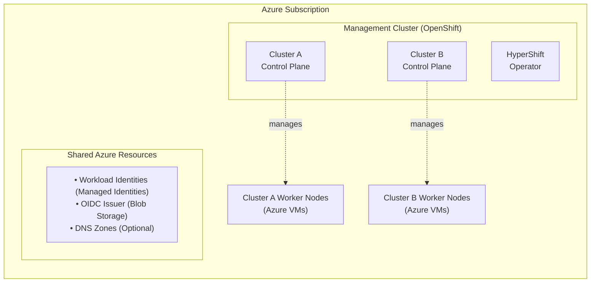

# Understanding HyperShift on Azure

!!! note "Developer Preview in OCP 4.21"

    Self-managed Azure HostedClusters are available as a Developer Preview feature in OpenShift Container Platform 4.21.

## What is Self-Managed Azure HyperShift?

Self-managed Azure HyperShift enables you to deploy and manage OpenShift hosted control planes on an OpenShift management cluster running in Azure. This architecture allows you to:

- **Reduce costs**: Run multiple OpenShift control planes as pods on a shared management cluster
- **Improve density**: Host dozens of control planes on the same infrastructure
- **Simplify management**: Centralize control plane operations while isolating workload data planes
- **Increase flexibility**: Choose your own management cluster platform and customize networking

## Architecture Overview

### High-Level Architecture

Self-managed Azure HyperShift deployments consist of three key layers:

1. **Management Cluster**: An existing OpenShift cluster running in Azure that hosts the HyperShift operator and control plane pods for your hosted clusters
2. **Control Plane**: Kubernetes control plane components (API server, etcd, controllers) running as pods on the management cluster
3. **Data Plane**: Worker nodes running as Azure Virtual Machines in your Azure subscription, managed by the control plane

### Key Components

#### Management Cluster
- Must be an OpenShift cluster running in Azure
- Hosts the HyperShift operator which manages the lifecycle of hosted clusters
- Runs control plane pods for multiple hosted clusters
- Must have sufficient capacity for control plane workloads

#### Hosted Control Plane
- Runs as a set of pods on the management cluster
- Includes API server, etcd, controller manager, scheduler
- Isolated per hosted cluster for security and multi-tenancy
- Communicates with worker nodes via Azure networking

#### Worker Nodes
- Standard Azure Virtual Machines in your subscription
- Join the hosted cluster via machine provisioning
- Run your application workloads
- Managed by the control plane components

#### Authentication & Identity
- Uses [Azure Workload Identity](https://azure.github.io/azure-workload-identity/docs/) for secure, credential-free authentication
- Federated identity credentials enable OpenShift service accounts to authenticate with Azure APIs
- Eliminates the need for long-lived service principal credentials
- Each OpenShift component (storage, networking, etc.) gets its own managed identity with minimal required permissions

### Security Architecture

Self-managed Azure HyperShift implements several security best practices:

1. **Workload Identity Federation**: Uses OIDC-based authentication to eliminate long-lived credentials
2. **Least Privilege Access**: Each component gets its own managed identity with minimal required permissions
3. **Network Isolation**: Custom VNets and NSGs allow you to implement network segmentation and security policies
4. **Federated Credentials**: Trust relationships are scoped to specific service accounts, preventing unauthorized access
5. **Control Plane Isolation**: Each hosted cluster's control plane runs in isolated pods on the management cluster

## Resource Lifecycle

Understanding the lifecycle of Azure resources is critical for proper management:

### One-Time Shared Resources
These resources are created once and shared across all hosted clusters:

- **OIDC Issuer** (Azure Blob Storage): Provides the OpenID Connect endpoint for workload identity federation
- **Service Account Signing Keys**: Used to sign service account tokens for workload identity

### Per-Cluster Persistent Resources
These resources are created per hosted cluster and persist even after cluster deletion:

- **Managed Identities** (7 per cluster): One for each OpenShift component (image-registry, ingress, disk-csi, file-csi, nodepool-mgmt, cloud-provider, network)
- **Federated Identity Credentials** (14 per cluster): Link managed identities to specific OpenShift service accounts

!!! important "Why Persistent?"

    Managed identities and federated credentials persist after cluster deletion to:

    - Allow cluster recreation without recreating identities
    - Maintain Azure IAM role assignments
    - Preserve audit trails and access logs
    - Support disaster recovery scenarios

### Per-Cluster Temporary Resources
These resources are created and deleted with each hosted cluster:

- **Virtual Network (VNet)**: Provides network isolation for cluster resources
- **Network Security Group (NSG)**: Controls network traffic rules
- **Subnets**: Network segments within the VNet
- **Resource Groups**: Container for cluster networking resources
- **Virtual Machines**: Worker nodes for the cluster

## When to Use HyperShift

HyperShift is ideal for:

- **Multi-tenancy scenarios**: Providing isolated OpenShift clusters for different teams or customers
- **Development/testing environments**: Quickly spinning up and tearing down clusters
- **Edge deployments**: Running lightweight control planes with distributed worker nodes
- **Cost optimization**: Consolidating control planes to reduce infrastructure costs
- **Simplified operations**: Managing multiple clusters from a single management plane

## How it Differs from Standalone OpenShift

| Aspect | Standalone OpenShift | HyperShift |
|--------|---------------------|------------|
| **Control Plane** | Runs on dedicated master nodes | Runs as pods on management cluster |
| **Infrastructure** | Requires dedicated control plane VMs | Shares management cluster resources |
| **Deployment Time** | Longer (provisions control plane VMs) | Faster (deploys control plane pods) |
| **Density** | One cluster per set of master nodes | Many clusters per management cluster |
| **Management** | Each cluster managed independently | Centralized management via HyperShift operator |
| **Cost** | Higher (dedicated control plane infra) | Lower (shared control plane infra) |
| **Isolation** | Network and compute isolation | Pod-level isolation in management cluster |

## Next Steps

Now that you understand the architecture, proceed to:

- [Azure Planning](02a-azure-planning.md) - Review Azure prerequisites and make key planning decisions
- [Workflow & Setup](02b-workflow-planning.md) - Understand the repository workflow and configuration
- [Azure Foundation Setup](03-azure-foundation.md) - Set up the Azure infrastructure components
