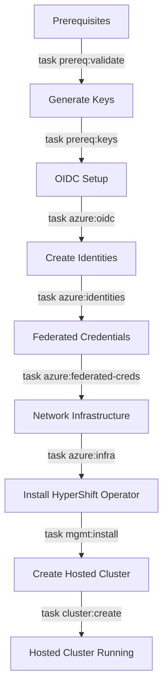

# Workflow & Repository Setup

This guide explains how this repository is structured, how to configure it, and the overall deployment workflow.

## Tools Installation

Before you begin, install the required tools on your workstation.

### HyperShift CLI

Download the HyperShift CLI for your platform from [GitHub Releases](https://github.com/hypershift-community/azure-dev-preview/releases/latest):

=== "Linux"

    ```bash
    # amd64
    curl -LO https://github.com/hypershift-community/azure-dev-preview/releases/latest/download/hypershift-linux-amd64.tar.gz
    tar -xzf hypershift-linux-amd64.tar.gz
    sudo install -m 0755 hypershift /usr/local/bin/hypershift

    # arm64
    curl -LO https://github.com/hypershift-community/azure-dev-preview/releases/latest/download/hypershift-linux-arm64.tar.gz
    tar -xzf hypershift-linux-arm64.tar.gz
    sudo install -m 0755 hypershift /usr/local/bin/hypershift
    ```

=== "macOS"

    ```bash
    # Intel
    curl -LO https://github.com/hypershift-community/azure-dev-preview/releases/latest/download/hypershift-darwin-amd64.tar.gz
    tar -xzf hypershift-darwin-amd64.tar.gz
    sudo install -m 0755 hypershift /usr/local/bin/hypershift

    # Apple Silicon
    curl -LO https://github.com/hypershift-community/azure-dev-preview/releases/latest/download/hypershift-darwin-arm64.tar.gz
    tar -xzf hypershift-darwin-arm64.tar.gz
    sudo install -m 0755 hypershift /usr/local/bin/hypershift
    ```

Verify the installation:

```bash
hypershift version
```

### Azure CLI

Install the Azure CLI for your platform:

=== "macOS"

    ```bash
    brew install azure-cli
    ```

=== "Linux"

    ```bash
    # Ubuntu/Debian
    curl -sL https://aka.ms/InstallAzureCLIDeb | sudo bash

    # RHEL/Fedora/CentOS
    sudo rpm --import https://packages.microsoft.com/keys/microsoft.asc
    sudo dnf install -y azure-cli

    # Other distributions: https://learn.microsoft.com/cli/azure/install-azure-cli
    ```

Verify and authenticate:

```bash
az version
az login
```

### Other Required Tools

Install the remaining tools:

#### jq (JSON processor)

=== "macOS"

    ```bash
    brew install jq
    ```

=== "Linux"

    ```bash
    # Debian/Ubuntu
    sudo apt install jq

    # RHEL/Fedora/CentOS
    sudo yum install jq
    ```

#### ccoctl (Cloud Credential Operator utility)

Download from the [OpenShift mirror](https://mirror.openshift.com/pub/openshift-v4/clients/ocp/):

=== "Linux"

    ```bash
    # Download the OpenShift client tools package which includes ccoctl
    # Replace VERSION with your OpenShift version (e.g., 4.21.0)
    VERSION="stable-4.21"
    curl -LO https://mirror.openshift.com/pub/openshift-v4/clients/ocp/${VERSION}/openshift-client-tools-linux-amd64.tar.gz
    tar -xzf openshift-client-tools-linux-amd64.tar.gz
    sudo install -m 0755 ccoctl /usr/local/bin/ccoctl
    ```

=== "macOS"

    ```bash
    # Download the OpenShift client tools package which includes ccoctl
    # Replace VERSION with your OpenShift version (e.g., 4.21.0)
    VERSION="stable-4.21"

    # For Intel Macs
    curl -LO https://mirror.openshift.com/pub/openshift-v4/clients/ocp/${VERSION}/openshift-client-tools-mac-amd64.tar.gz
    tar -xzf openshift-client-tools-mac-amd64.tar.gz
    sudo install -m 0755 ccoctl /usr/local/bin/ccoctl

    # For Apple Silicon Macs
    curl -LO https://mirror.openshift.com/pub/openshift-v4/clients/ocp/${VERSION}/openshift-client-tools-mac-arm64.tar.gz
    tar -xzf openshift-client-tools-mac-arm64.tar.gz
    sudo install -m 0755 ccoctl /usr/local/bin/ccoctl
    ```

#### task (Task runner)

=== "macOS"

    ```bash
    brew install go-task
    ```

=== "Linux"

    ```bash
    sh -c "$(curl -fsSL https://taskfile.dev/install.sh)" -- -b /usr/local/bin

    # Or download from: https://taskfile.dev/installation/
    ```

#### oc (OpenShift CLI)

Download from the same OpenShift client tools package as ccoctl:

=== "Linux"

    ```bash
    # oc is included in the openshift-client-tools package
    sudo install -m 0755 oc /usr/local/bin/oc
    ```

=== "macOS"

    ```bash
    # oc is included in the openshift-client-tools package
    sudo install -m 0755 oc /usr/local/bin/oc
    ```

Verify all tools are installed:

```bash
az version
jq --version
ccoctl version
task --version
oc version
hypershift version
```

### Clone the Repository

Clone this repository and navigate to the working directory:

```bash
git clone https://github.com/hypershift-community/azure-dev-preview.git
cd azure-dev-preview/hack/dev-preview
```

All commands in this guide should be run from the `hack/dev-preview` directory unless otherwise specified.

## Repository Structure

This repository uses **Taskfile automation** (via [go-task/task](https://taskfile.dev)) to simplify the deployment process. All deployment steps are automated through task commands.

**Key directories:**
```
hypershift/
├── hack/dev-preview/
│   ├── Taskfile.yml           # Main configuration and task definitions
│   ├── envrc.example          # Optional environment variable template
│   └── tasks/                 # Task implementation files
│       ├── azure.yml          # Azure infrastructure tasks
│       ├── prereq.yml         # Prerequisite validation tasks
│       ├── mgmt.yml           # Management cluster tasks
│       └── cluster.yml        # Hosted cluster tasks
└── bin/
    └── hypershift              # HyperShift CLI binary
```

## Configuration: Taskfile vs Environment Variables

You have two options for providing configuration values to the automation:

### Option 1: Using Taskfile Variables (Recommended)

**Best for:** Most users, clear documentation, validation

All configuration is defined directly in `hack/dev-preview/Taskfile.yml`:

```yaml
vars:
  # Azure Subscription
  PREFIX: 'myorg-dev'
  SUBSCRIPTION_ID: 'xxxxxxxx-xxxx-xxxx-xxxx-xxxxxxxxxxxx'
  TENANT_ID: 'xxxxxxxx-xxxx-xxxx-xxxx-xxxxxxxxxxxx'
  LOCATION: 'eastus'

  # Persistent Resources
  PERSISTENT_RG_NAME: 'hypershift-shared'
  OIDC_STORAGE_ACCOUNT_NAME: 'myorgoidc1234567890'

  # Cluster Configuration
  CLUSTER_NAME: '{{.PREFIX}}-hc'

  # Credentials
  AZURE_CREDS: 'azure-credentials.json'
  PULL_SECRET: 'pull-secret.json'

  # Optional: DNS Configuration (if using External DNS)
  PARENT_DNS_ZONE: 'azure.example.com'
  EXTERNAL_DNS_DOMAIN: '{{.CLUSTER_NAME}}.{{.PARENT_DNS_ZONE}}'

  # ... additional variables
```

**Advantages:**

- **Self-documenting**: All configuration visible in one place
- **Validation**: Taskfile validates required variables before execution
- **Consistency**: Same values used across all tasks
- **Version control**: Can commit your Taskfile.yml (excluding secrets)

**How to use:**

1. Edit `hack/dev-preview/Taskfile.yml`
2. Update the `vars:` section with your values
3. Run tasks: `task azure:oidc`, `task cluster:create`, etc.

#### Understanding Naming Pattern Variables

The example above shows several variables that work together to create consistent naming across your deployment:

| Variable | Purpose | Example Value | Used For |
|----------|---------|---------------|----------|
| `PREFIX` | Organization/environment identifier | `myorg-dev` | Prefixing all cluster-specific resources |
| `CLUSTER_NAME` | Hosted cluster name | `{{.PREFIX}}-hc` → `myorg-dev-hc` | HostedCluster resource name |
| `PERSISTENT_RG_NAME` | Persistent resource group | `hypershift-shared` | Long-lived shared resources (OIDC, identities) |
| `VNET_RG_NAME` | VNet resource group | `{{.PREFIX}}-vnet-rg` → `myorg-dev-vnet-rg` | Per-cluster network resources |

**Naming pattern in action:**

```bash
# These variables...
PREFIX="myorg-dev"
CLUSTER_NAME="${PREFIX}-hc"           # Evaluates to: myorg-dev-hc
PERSISTENT_RG="hypershift-shared"     # Shared across all clusters
VNET_RG_NAME="${PREFIX}-vnet-rg"      # Evaluates to: myorg-dev-vnet-rg
```

**Why this pattern?**

- **Consistency**: All related resources share the same prefix
- **Clarity**: Easy to identify which resources belong to which cluster
- **Separation**: Persistent resources use static names, temporary resources use cluster-specific prefixes
- **Multiple clusters**: Change `PREFIX` to deploy multiple clusters (e.g., `myorg-prod`, `myorg-test`)

### Option 2: Using Environment Variables (.envrc)

**Best for:** Users who prefer environment variables, integration with direnv

An `envrc.example` file is provided as a template. You can copy it to `.envrc` and customize:

```bash
# Copy the template
cp hack/dev-preview/envrc.example hack/dev-preview/.envrc

# Edit with your values
vim hack/dev-preview/.envrc
```

Example `.envrc` content:
```bash
export PREFIX="myorg-dev"
export SUBSCRIPTION_ID="xxxxxxxx-xxxx-xxxx-xxxx-xxxxxxxxxxxx"
export TENANT_ID="xxxxxxxx-xxxx-xxxx-xxxx-xxxxxxxxxxxx"
export LOCATION="eastus"
export PERSISTENT_RG_NAME="hypershift-shared"
export OIDC_STORAGE_ACCOUNT_NAME="myorgoidc1234567890"
# ... additional variables
```

**Advantages:**

- **Environment integration**: Works with tools like [direnv](https://direnv.net/)
- **Shell independence**: Can source from any shell
- **Flexibility**: Override specific variables as needed

**How to use:**

1. Copy `envrc.example` to `.envrc`
2. Edit `.envrc` with your values
3. Source it: `source .envrc` (or use direnv)
4. Run tasks: `task azure:oidc`, `task cluster:create`, etc.

!!! note "How Taskfile Reads Variables"

    The Taskfile will check for environment variables first, then fall back to values defined in the `vars:` section. This means:

    - If you set `export PREFIX="my-value"`, it overrides `PREFIX: 'myorg-dev'` in Taskfile.yml
    - If no environment variable exists, Taskfile uses the value from `vars:`
    - **Recommendation**: Pick one approach and stick with it for clarity

!!! warning "Don't Commit Secrets"

    - Never commit `.envrc` with real credentials to version control
    - The `.gitignore` excludes `.envrc` by default
    - Keep `azure-credentials.json` and `pull-secret.json` out of version control

## Deployment Flow

Understanding the deployment sequence helps you troubleshoot and understand what each step does.



### Step-by-Step Breakdown

1. **Validate Prerequisites** (`task prereq:validate`)

      - Checks all required tools are installed (az, jq, ccoctl, task, oc, hypershift)
      - Verifies credential files exist (azure-credentials.json, pull-secret.json)
      - Validates Azure authentication

2. **Generate Signing Keys** (`task prereq:keys`)

      - Creates RSA key pair for service account token signing
      - Generates `serviceaccount-signer.private` and `serviceaccount-signer.public`
      - Required for OpenShift service account authentication

3. **OIDC Setup** (`task azure:oidc`)

      - Creates Azure Storage Account for OIDC issuer (one-time, persistent)
      - Uploads OIDC discovery document and JWKS
      - Enables external identity federation for workload identities

4. **Create Managed Identities** (`task azure:identities`)

      - Creates managed identities for each cluster component (storage, networking, etc.)
      - Assigns Azure RBAC roles (per cluster, persistent)
      - Outputs `workload-identities.json`

5. **Configure Federated Credentials** (`task azure:federated-creds`)

      - Links managed identities to OpenShift service accounts
      - Establishes trust relationship via OIDC
      - Enables credential-free Azure API access

6. **Create Network Infrastructure** (`task azure:infra`)

      - Creates VNet, NSG, subnets (per cluster, temporary)
      - Configures network security rules
      - Exports network resource IDs to `.azure-net-ids`

7. **Install HyperShift Operator** (`task mgmt:install`)

      - Deploys HyperShift operator on management cluster
      - Configures operator with Azure credentials
      - Optionally installs External DNS operator

8. **Create Hosted Cluster** (`task cluster:create`)

      - Invokes `hypershift create cluster azure` with all parameters
      - Deploys control plane pods on management cluster
      - Provisions worker nodes as Azure VMs
      - Creates NodePool for data plane

9. **Hosted Cluster Running**

      - Control plane pods running on management cluster
      - Worker nodes joined and ready
      - Cluster accessible via API and console

### One-Shot Deployment

For automation or quick deployments, you can run all steps sequentially:

```bash
# Full deployment (Azure infra + management cluster + hosted cluster)
task setup

# Or step-by-step:
task prereq:validate
task prereq:keys
task azure:oidc
task azure:identities
task azure:federated-creds
task azure:infra
task mgmt:install
task cluster:create
```

!!! tip "Step-by-Step vs One-Shot"

    - **Step-by-step**: Recommended for learning, troubleshooting, understanding each phase
    - **One-shot** (`task setup`): Best for automation, repeated deployments, when familiar with the process

## Task Philosophy

The Taskfile approach provides:

- **Idempotency**: Most tasks can be re-run safely (they check if resources exist)
- **Modularity**: Each task focuses on one logical phase
- **Visibility**: Task output shows exactly what commands are being run
- **Under the hood**: Documentation includes the actual CLI commands for educational purposes

## Next Steps

Now that you understand how the repository works:

- [Azure Foundation Setup](03-azure-foundation.md) - Start deploying Azure infrastructure
- [Management Cluster Setup](04-management-cluster.md) - Install the HyperShift operator
- [Create Hosted Cluster](05-hosted-cluster.md) - Deploy your first hosted cluster
