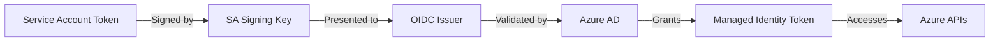

# Create and Manage Hosted Clusters

This guide covers the end-to-end process of creating, accessing, and destroying HyperShift hosted clusters on Azure using Taskfile automation.

!!! note "Persona: HyperShift Administrator"

    This phase creates your actual OpenShift hosted clusters that run application workloads.

## Overview

Deploying a hosted cluster involves:

1. **Workload Identity Creation**: Per-cluster managed identities and federated credentials
2. **Infrastructure Provisioning**: Azure VNets, subnets, network security groups, and resource groups
3. **HostedCluster Deployment**: Control plane on management cluster, worker nodes as Azure VMs
4. **Cluster Access**: Generate kubeconfig and verify cluster operation

**Why This Matters**: This creates the actual OpenShift cluster where your applications will run. The control plane runs as pods on the management cluster, while worker nodes run as Azure VMs. The cluster uses workload identities for secure, credential-free access to Azure services.

## Prerequisites

Before creating a hosted cluster, ensure:

- [Azure Foundation Setup](03-azure-foundation.md) completed (OIDC issuer, signing keys)
- [Management Cluster Setup](04-management-cluster.md) completed (HyperShift operator installed)
- Taskfile configuration completed in `hack/dev-preview/Taskfile.yml`
- Azure credentials file created (`azure-credentials.json`)
- OpenShift pull secret available (`pull-secret.json`)

Required Taskfile variables:
```yaml
PREFIX: 'myprefix'
CLUSTER_NAME: '${PREFIX}-hc'
RELEASE_IMAGE: 'quay.io/openshift-release-dev/ocp-release:4.21.0-x86_64'
AZURE_CREDS: 'azure-credentials.json'
PULL_SECRET: 'pull-secret.json'
```

## Creating a Hosted Cluster

### Step 1: Create Workload Identities

Create the managed identities and federated credentials for your cluster:

```bash
# Create 7 managed identities for cluster components
task azure:identities

# Create 14 federated identity credentials
task azure:federated-creds
```

**What this does**:
- Creates 7 managed identities (one per OpenShift component)
- Creates 14 federated credentials (2 per component for redundancy)
- Generates `workload-identities.json` file with client IDs
- These resources persist after cluster deletion

**Components with identities**:
- Image Registry
- Ingress
- Disk CSI Driver
- File CSI Driver
- NodePool Management
- Cloud Provider
- Network

**Output**:
```
Creating 7 managed identities for cluster myprefix-hc...
✓ Created identity: myprefix-hc-image-registry
✓ Created identity: myprefix-hc-ingress
...
Creating 14 federated identity credentials...
✓ Created federated credential for openshift-image-registry/installer
...
```

!!! important "Identity Persistence"

    Managed identities and federated credentials are **persistent**. They:

    - Remain after cluster deletion
    - Allow cluster recreation without identity recreation
    - Preserve Azure IAM role assignments
    - Support disaster recovery scenarios

    To delete identities: `task azure:delete-identities` (only when cluster is permanently removed)

### Step 2: Provision Azure Infrastructure

Create the VNet, NSG, subnets, and resource groups:

```bash
task azure:infra
```

**What this does**:
- Creates managed resource group for cluster resources
- Creates VNet resource group
- Creates NSG resource group
- Provisions VNet with `/16` address space
- Creates subnet with `/24` address space
- Creates and configures Network Security Group
- Exports resource IDs to `.azure-net-ids` file

**Under the hood** (see `tasks/azure.yml`):
```bash
# Resource group creation
az group create --name ${MANAGED_RG_NAME} --location ${LOCATION}
az group create --name ${VNET_RG_NAME} --location ${LOCATION}
az group create --name ${NSG_RG_NAME} --location ${LOCATION}

# NSG creation
az network nsg create \
    --resource-group ${NSG_RG_NAME} \
    --name ${NSG}

# VNet and subnet creation
az network vnet create \
    --name ${VNET_NAME} \
    --resource-group ${VNET_RG_NAME} \
    --address-prefix 10.0.0.0/16 \
    --subnet-name ${VNET_SUBNET1} \
    --subnet-prefixes 10.0.0.0/24 \
    --nsg ${NSG_ID}
```

**Output**:
```
Creating Azure infrastructure for cluster...
✓ Created resource group: myprefix-managed-rg
✓ Created resource group: myprefix-vnet-rg
✓ Created resource group: myprefix-nsg-rg
✓ Created NSG: myprefix-nsg
✓ Created VNet: myprefix-vnet
✓ Created subnet: myprefix-subnet-1
Exported resource IDs to .azure-net-ids
```

!!! tip "Infrastructure Lifecycle"

    This infrastructure is **temporary** and deleted with the cluster. Use `task azure:delete-infra` to remove it.

### Step 3: Create the HostedCluster

Create the hosted cluster using all the prepared resources:

```bash
task cluster:create
```

**What this does**:
- Validates all prerequisites (resource groups, identities, credentials)
- Reads network resource IDs from `.azure-net-ids`
- Reads workload identities from `workload-identities.json`
- Invokes `hypershift create cluster azure` with all required parameters
- Deploys control plane pods on management cluster
- Provisions worker nodes as Azure VMs

**Under the hood** (see `tasks/cluster.yml`):
```bash
hypershift create cluster azure \
    --name ${CLUSTER_NAME} \
    --namespace ${CLUSTER_NAMESPACE} \
    --azure-creds ${AZURE_CREDS} \
    --location ${LOCATION} \
    --node-pool-replicas ${NODE_POOL_REPLICAS} \
    --base-domain ${PARENT_DNS_ZONE} \
    --dns-zone-rg-name ${PERSISTENT_RG_NAME} \
    --pull-secret ${PULL_SECRET} \
    --generate-ssh \
    --release-image ${RELEASE_IMAGE} \
    --resource-group-name ${MANAGED_RG_NAME} \
    --vnet-id ${VNET_ID} \
    --subnet-id ${SUBNET_ID} \
    --network-security-group-id ${NSG_ID} \
    --sa-token-issuer-private-key-path ${SA_TOKEN_ISSUER_PRIVATE_KEY_PATH} \
    --oidc-issuer-url ${OIDC_ISSUER_URL} \
    --assign-service-principal-roles \
    --workload-identities-file ./workload-identities.json \
    --diagnostics-storage-account-type Managed
```

**Expected output**:
```
Creating hosted cluster myprefix-hc
========================================
OpenShift Details:
  Release: quay.io/openshift-release-dev/ocp-release:4.21.0-x86_64
========================================
Azure Details:
  Resource Group: myprefix-managed-rg
  Location: eastus
  Base Domain: example.com
  DNS Zone RG: hypershift-shared
========================================
✓ Hosted cluster myprefix-hc created successfully
```

!!! note "Azure Marketplace Images"

    For OpenShift 4.20+, HyperShift automatically selects the appropriate Azure Marketplace image from the release payload. No `--marketplace-*` flags needed.

    For custom images or VM generation control, see [Advanced Configuration](#advanced-configuration).

### Step 4: Verify Cluster Creation

Monitor cluster creation progress:

```bash
# Check HostedCluster status
oc get hostedcluster ${CLUSTER_NAME} -n ${CLUSTER_NAMESPACE}

# Watch cluster become available (15-30 minutes)
oc wait --for=condition=Available \
    hostedcluster/${CLUSTER_NAME} \
    -n ${CLUSTER_NAMESPACE} \
    --timeout=30m

# Check NodePool status
oc get nodepool -n ${CLUSTER_NAMESPACE}

# Verify control plane pods are running
oc get pods -n clusters-${CLUSTER_NAME}
```

**Healthy cluster indicators**:
```bash
# HostedCluster should show Available=True
NAME          VERSION   KUBECONFIG                      PROGRESS    AVAILABLE   PROGRESSING   MESSAGE
myprefix-hc   4.21.0    myprefix-hc-admin-kubeconfig   Completed   True        False         The hosted cluster is available

# NodePool should show all replicas ready
NAME                 CLUSTER       DESIRED NODES   CURRENT NODES   AUTOSCALING   AUTOREPAIR   VERSION   UPDATINGVERSION   UPDATINGCONFIG   MESSAGE
myprefix-hc          myprefix-hc   2               2               False         False        4.21.0

# Control plane pods all Running
NAME                                          READY   STATUS    RESTARTS   AGE
capi-provider-5d4c6b9d8-xxxxx                1/1     Running   0          10m
catalog-operator-6b8c9f8b7-xxxxx             2/2     Running   0          8m
cluster-api-7b9c8d7f6-xxxxx                  1/1     Running   0          10m
...
```

### Step 5: Access Your Cluster

Generate kubeconfig and access the hosted cluster:

```bash
# Generate kubeconfig for your cluster
hypershift create kubeconfig \
    --name ${CLUSTER_NAME} \
    --namespace ${CLUSTER_NAMESPACE} \
    > ${CLUSTER_NAME}-kubeconfig

# Set KUBECONFIG to access hosted cluster
export KUBECONFIG=${CLUSTER_NAME}-kubeconfig

# Verify cluster access
oc get nodes
oc get clusterversion
oc get co  # Check cluster operators status
```

**Expected output**:
```bash
# Nodes should be Ready
NAME                                     STATUS   ROLES    AGE   VERSION
myprefix-hc-nodepool-1-xxxxx            Ready    worker   5m    v1.31.0
myprefix-hc-nodepool-1-yyyyy            Ready    worker   5m    v1.31.0

# ClusterVersion should show correct version
NAME      VERSION   AVAILABLE   PROGRESSING   SINCE   STATUS
version   4.21.0    True        False         3m      Cluster version is 4.21.0

# Cluster operators should be Available
NAME                                       VERSION   AVAILABLE   PROGRESSING   DEGRADED   SINCE   MESSAGE
authentication                             4.21.0    True        False         False      5m
console                                    4.21.0    True        False         False      3m
...
```

!!! success "Cluster Ready"

    Your hosted cluster is now operational! You can deploy applications, configure cluster settings, and perform all standard OpenShift operations.

## Destroying a Hosted Cluster

When you're done with a cluster, clean it up to avoid unnecessary costs.

### Option 1: Complete Cleanup (Recommended)

Delete the cluster and all temporary infrastructure:

```bash
# 1. Destroy the HostedCluster (this deletes VMs and cluster resources)
task cluster:destroy

# 2. Delete Azure infrastructure (VNet, NSG, resource groups)
task azure:delete-infra
```

**What this does**:
- Deletes HostedCluster and NodePool resources from management cluster
- Removes worker node VMs from Azure
- Deletes control plane pods from management cluster
- Removes VNet, NSG, subnets, and resource groups
- **Preserves**: Managed identities and federated credentials (for recreation)

### Option 2: Delete Cluster Only (Keep Infrastructure)

Delete just the cluster, preserving infrastructure for quick recreation:

```bash
task cluster:destroy
```

**When to use**: Testing scenarios where you want to quickly recreate clusters with the same network infrastructure.

### Option 3: Complete Removal Including Identities

Permanently remove all cluster-related resources including identities:

```bash
# 1. Destroy the cluster
task cluster:destroy

# 2. Delete infrastructure
task azure:delete-infra

# 3. Delete workload identities (CAUTION: permanent)
task azure:delete-identities
```

!!! danger "Deleting Identities"

    Only delete identities when the cluster is **permanently removed** and will never be recreated. Deleting identities:

    - Removes all Azure role assignments
    - Requires full identity recreation for new clusters with same name
    - Cannot be undone

## Advanced Configuration

### Using Custom Control Plane Operator Image

Override the CPO image for testing or debugging:

```yaml
# In Taskfile.yml
vars:
  CPO_IMAGE: 'quay.io/hypershift/hypershift:custom-tag'
```

The cluster creation task automatically detects and uses the custom image.

### Configuring Azure Marketplace Images

**For OpenShift 4.20+ (Recommended)**:

HyperShift auto-selects the appropriate image. No configuration needed.

**For Custom Images**:

Add to your `hypershift create cluster azure` command:
```bash
--marketplace-publisher azureopenshift \
--marketplace-offer aro4 \
--marketplace-sku aro_421 \
--marketplace-version 421.0.20250101 \
--image-generation Gen2  # Gen1 or Gen2
```

!!! important "Marketplace Flag Requirements"

    When specifying marketplace details, provide **all four** flags together.

### Customizing Network Configuration

Modify network settings in `Taskfile.yml`:

```yaml
vars:
  VNET_CIDR: '10.0.0.0/16'          # Default VNet CIDR
  SUBNET_CIDR: '10.0.0.0/24'         # Default subnet CIDR
  VNET_NAME: '${PREFIX}-custom-vnet'  # Custom VNet name
```

Then regenerate infrastructure:
```bash
task azure:delete-infra  # Clean up old infrastructure
task azure:infra         # Create with new configuration
```

### Using External DNS

If you configured External DNS during management cluster setup:

**In Taskfile.yml**, ensure:
```yaml
vars:
  PARENT_DNS_ZONE: 'example.com'
  # External DNS will create: api.myprefix-hc.example.com
```

The cluster creation task automatically includes DNS configuration when External DNS is available.

### Scaling NodePools

Scale worker nodes after cluster creation:

```bash
# Scale existing NodePool
oc scale nodepool/${CLUSTER_NAME} \
    -n ${CLUSTER_NAMESPACE} \
    --replicas=5

# Verify scaling
oc get nodepool -n ${CLUSTER_NAMESPACE}
```

## Troubleshooting Cluster Creation

### Cluster Stuck in Provisioning

**Symptom**: HostedCluster remains in `Progressing` state for >30 minutes

**Check**:
```bash
# Check HostedCluster status
oc get hostedcluster ${CLUSTER_NAME} -n ${CLUSTER_NAMESPACE} -o yaml

# Check control plane pods
oc get pods -n clusters-${CLUSTER_NAME}

# Check operator logs
oc logs -n hypershift deployment/operator
```

**Common causes**:
- Insufficient resources on management cluster
- Image pull errors (check pull secret)
- Azure API rate limiting
- Network connectivity issues

### Worker Nodes Not Joining

**Symptom**: NodePool shows desired nodes, but nodes don't appear as Ready

**Check**:
```bash
# Check NodePool status
oc get nodepool -n ${CLUSTER_NAMESPACE} -o yaml

# Check machine resources
oc get machines -n clusters-${CLUSTER_NAME}

# Check Azure VMs
az vm list \
    --resource-group ${MANAGED_RG_NAME} \
    --output table
```

**Common causes**:
- Workload identity misconfiguration
- NSG blocking required ports
- Ignition server unreachable
- Azure quota limits

### Workload Identity Authentication Failures

**Symptom**: Control plane pods reporting Azure authentication errors

**Check**:
```bash
# Verify workload-identities.json exists and has valid client IDs
cat workload-identities.json | jq

# Check federated credentials in Azure
task azure:list-federated-creds

# Verify OIDC issuer is accessible
curl ${OIDC_ISSUER_URL}/.well-known/openid-configuration
```

**Solutions**:
- Recreate federated credentials: `task azure:delete-federated-creds && task azure:federated-creds`
- Verify OIDC issuer URL matches in Taskfile and Azure
- Check that PREFIX and CLUSTER_NAME are identical to identity creation

### DNS Resolution Issues

**For External DNS deployments**:

**Check**:
```bash
# Check External DNS logs
oc logs -n hypershift deployment/external-dns

# Verify DNS records in Azure
az network dns record-set list \
    --resource-group ${PERSISTENT_RG_NAME} \
    --zone-name ${PARENT_DNS_ZONE}
```

**For deployments without External DNS**:

API server uses Azure LoadBalancer DNS. Get the DNS name:
```bash
oc get svc -n clusters-${CLUSTER_NAME} kube-apiserver

# Use the EXTERNAL-IP or LoadBalancer hostname
```

### Precondition Failures

If `task cluster:create` reports missing preconditions:

```bash
# Check managed resource group exists
task azure:infra

# Check workload identities file exists
task azure:identities

# Check network IDs file exists
ls -l .azure-net-ids

# Check credentials files
ls -l ${AZURE_CREDS} ${PULL_SECRET}
```

## Understanding Cluster Components

### Control Plane Architecture

The hosted control plane consists of pods running on the management cluster:

```bash
# View control plane namespace
oc get ns | grep clusters-${CLUSTER_NAME}

# View control plane pods
oc get pods -n clusters-${CLUSTER_NAME}
```

**Key components**:
- **kube-apiserver**: Cluster API endpoint
- **etcd**: Control plane data store
- **kube-controller-manager**: Cluster controllers
- **kube-scheduler**: Pod scheduling
- **cluster-version-operator**: Manages cluster version and upgrades
- **openshift-controller-manager**: OpenShift-specific controllers

### Data Plane Architecture

Worker nodes run as standard Azure VMs:

```bash
# View VMs in Azure
az vm list \
    --resource-group ${MANAGED_RG_NAME} \
    --output table

# SSH to a node (if SSH key was generated)
ssh -i ${CLUSTER_NAME}-ssh-key core@<node-ip>
```

### Workload Identity Integration

Each component authenticates to Azure using federated credentials:



## Next Steps

With your hosted cluster running:

- [Day 2 Operations](06-day2-operations.md) - Upgrades, scaling, configuration
- [Troubleshooting](07-troubleshooting.md) - Diagnostics and common issues
- Deploy your applications using standard OpenShift/Kubernetes workflows

## Quick Reference

### Essential Commands

```bash
# Create cluster (full workflow)
task azure:identities
task azure:federated-creds
task azure:infra
task cluster:create

# Access cluster
hypershift create kubeconfig --name ${CLUSTER_NAME} > kubeconfig
export KUBECONFIG=kubeconfig

# Check cluster status
oc get hostedcluster,nodepool -n ${CLUSTER_NAMESPACE}

# Destroy cluster
task cluster:destroy
task azure:delete-infra
```

### Task Summary

| Task | Purpose | Lifecycle |
|------|---------|-----------|
| `task azure:identities` | Create managed identities | Persistent |
| `task azure:federated-creds` | Create federated credentials | Persistent |
| `task azure:infra` | Provision VNet, NSG, resource groups | Temporary |
| `task cluster:create` | Deploy HostedCluster | Temporary |
| `task cluster:destroy` | Delete HostedCluster | - |
| `task azure:delete-infra` | Remove VNet, NSG, resource groups | - |
| `task azure:delete-identities` | Remove managed identities (CAUTION) | - |
| `task azure:delete-federated-creds` | Remove federated credentials | - |
