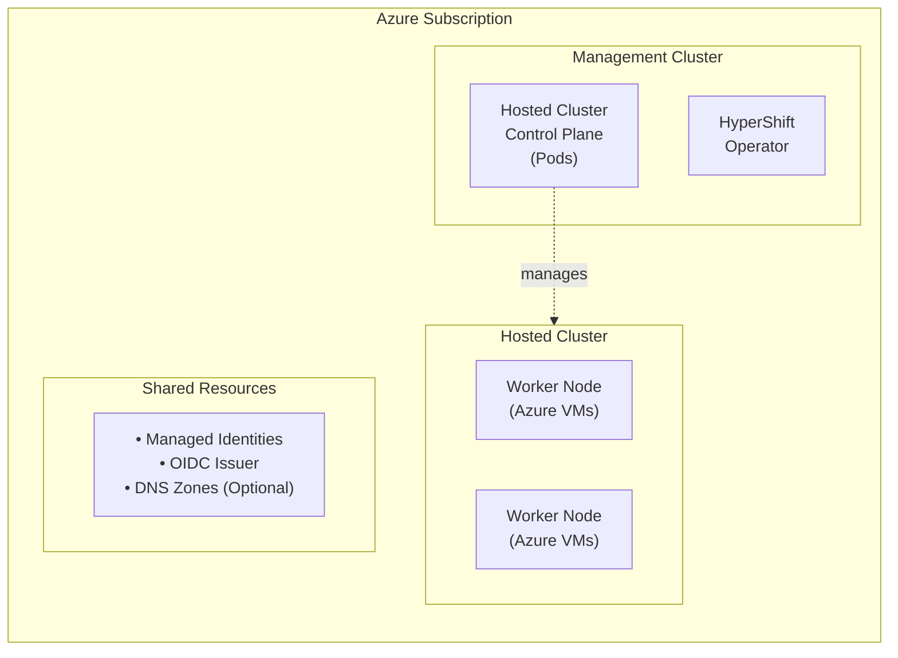

# HyperShift Self-Managed Azure (Developer Preview) - Getting Started Guide

Welcome to the HyperShift self-managed Azure onboarding repository. This guide will help you deploy OpenShift hosted control planes on your own Azure infrastructure using HyperShift.

## What is HyperShift?

HyperShift enables you to deploy and manage OpenShift hosted control planes on a management cluster. For self-managed Azure deployments, this means:

- **Reduced costs**: Run multiple OpenShift control planes as pods on a shared management cluster
- **Improved density**: Host dozens of control planes on the same infrastructure
- **Simplified management**: Centralize control plane operations while isolating workload data planes
- **Increased flexibility**: Choose your own management cluster platform and customize networking

## Who Is This For?

This guide is designed for:

- **OpenShift Administrators** looking to deploy hosted clusters on Azure
- **Platform Engineers** managing multi-tenant OpenShift environments
- **SREs** responsible for OpenShift infrastructure on Azure


## What You'll Build

By the end of this guide, you will have:

1. **Azure Foundation**: The Azure infrastructure needed to successfully setup HyperShift and create clusters (OIDC issuer, managed identities, networking)
2. **Management Cluster Setup**: HyperShift operator installed and configured on your OpenShift management cluster
3. **Hosted Cluster**: A fully functional OpenShift cluster with control plane running on the management cluster and worker nodes running as Azure VMs
4. **Working Knowledge**: Understanding of HyperShift architecture and day-2 operations

**Architecture you'll create:**



## Your Learning Path

Follow this structured path to deploy your first hosted cluster:

| Phase | Topic | What You'll Learn |
|-------|-------|-------------------|
| **1** | [Understanding](how-to/azure/self-managed/01-understanding.md) | HyperShift architecture, security model, and resource lifecycle |
| **2** | [Azure Planning](how-to/azure/self-managed/02a-azure-planning.md) | Azure-specific requirements, permissions, and decision points |
| **3** | [Workflow & Setup](how-to/azure/self-managed/02b-workflow-planning.md) | Repository structure, tool installation, and configuration options |
| **4** | [Azure Foundation](how-to/azure/self-managed/03-azure-foundation.md) | Create OIDC issuer, managed identities, and persistent resources |
| **5** | [Management Cluster](how-to/azure/self-managed/04-management-cluster.md) | Install HyperShift operator and configure External DNS (optional) |
| **6** | [Hosted Cluster](how-to/azure/self-managed/05-hosted-cluster.md) | Deploy your first hosted cluster with network infrastructure |
| **7** | [Day 2 Operations](how-to/azure/self-managed/06-day2-operations.md) | Scaling, upgrades, and ongoing cluster management |
| **8** | [Troubleshooting](how-to/azure/self-managed/07-troubleshooting.md) | Diagnostic procedures and solutions for common issues |
| **9** | [Reference](how-to/azure/self-managed/08-reference.md) | Command reference, appendices, and quick-reference guides |

## About Task

This repository uses [Task](https://taskfile.dev/) to automate deployment workflows. Task is a task runner and build tool that makes it easy to define and run commands in a clear, organized way.

**Why Task?**

Task provides self-contained, descriptive recipes that make complex operations simple:

- **Readable commands**: Each task has a clear name and description (e.g., `task azure:oidc` - "Create OIDC issuer")
- **Bundled operations**: Related commands are grouped together in logical tasks
- **Transparent execution**: See exactly what commands are being run under the hood
- **Flexible workflows**: Run individual tasks step-by-step or orchestrate full deployments
- **Reproducible**: Same commands work consistently across different environments

All Task commands shown in this guide use standard CLI tools (`az`, `ccoctl`, `hypershift`). The documentation includes "Under the hood" sections showing the actual commands being executed, so you can learn and adapt them for your own workflows.

## Deployment Approaches

This repository provides two workflows:

=== "Step-by-Step (Recommended for Learning)"

    Run each phase individually using Taskfile tasks. This approach helps you:

    - Understand what happens at each stage
    - Troubleshoot issues more easily
    - Learn the underlying Azure and HyperShift concepts

    **Example:**
    ```bash
    task prereq:validate   # Check prerequisites
    task azure:oidc        # Create OIDC issuer
    task azure:identities  # Create managed identities
    task cluster:create    # Deploy hosted cluster
    ```

=== "Single-Shot (For Automation)"

    Run the complete deployment with one command:

    ```bash
    task setup  # Orchestrates all phases automatically
    ```

    Best for: Quick deployment, automation, when already familiar with the process

All tasks use the same CLI commands (`az`, `ccoctl`, `hypershift`). The documentation shows the underlying commands in "Under the hood" sections for educational purposes.

## Ready to Start?

[Begin with Understanding HyperShift on Azure](how-to/azure/self-managed/01-understanding.md){ .md-button .md-button--primary }
